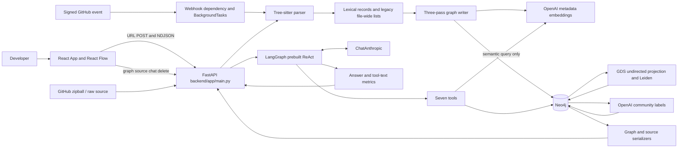
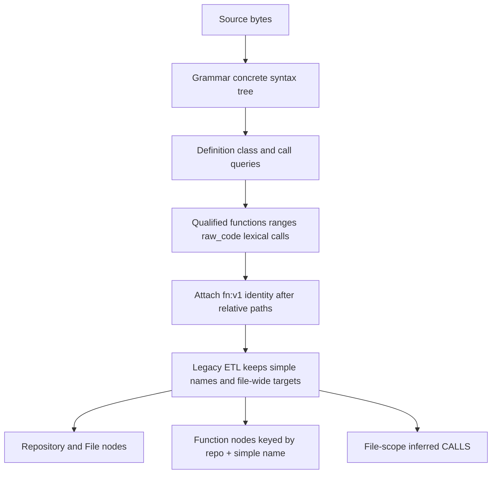
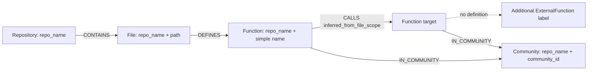
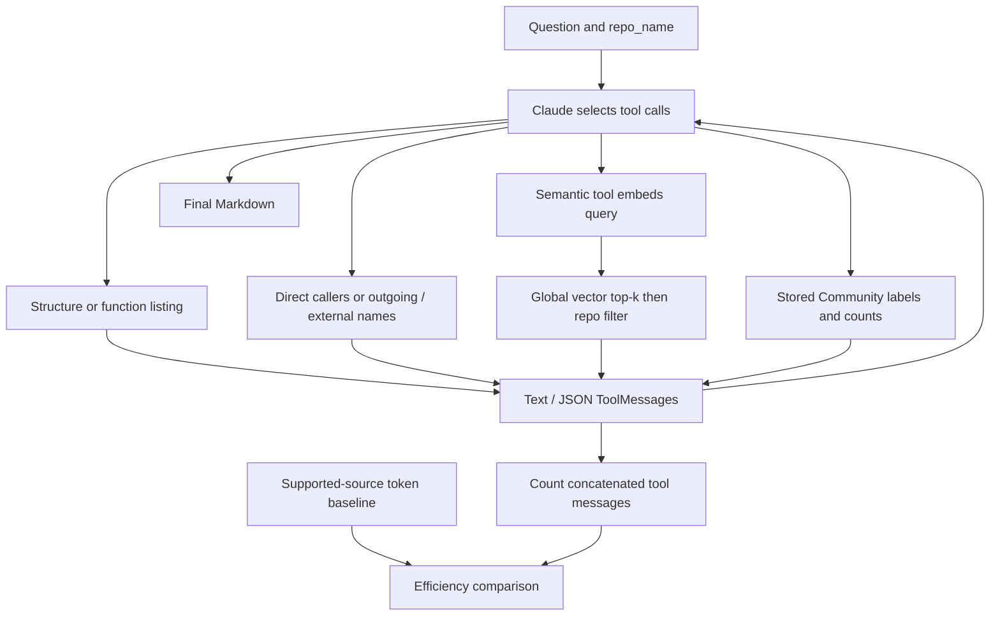

# Parts 1–13 — Foundations and data pipeline

[Start here](README.md) · [Master index](CODEGRAPH_ENGINEERING_MASTERY.md) · [Previous](CODEGRAPH_ENGINEERING_MASTERY.md) · [Next](02_APPLICATION_AND_AUDIT.md)

## Contents

- [1. Investigation method, revision, and evidence](#1-investigation-method-revision-and-evidence)
- [2. CodeGraph from first principles: five levels](#2-codegraph-from-first-principles-five-levels)
- [Level 1 — 20 seconds](#level-1--20-seconds)
- [Level 2 — 60 seconds](#level-2--60-seconds)
- [Level 3 — three-minute overview](#level-3--three-minute-overview)
- [Level 4 — detailed architecture walkthrough](#level-4--detailed-architecture-walkthrough)
- [Level 5 — source-level design review](#level-5--source-level-design-review)
- [3. Complete architecture](#3-complete-architecture)
- [4. Repository ingestion in exact order](#4-repository-ingestion-in-exact-order)
- [5. Tree-sitter and the intermediate representation](#5-tree-sitter-and-the-intermediate-representation)
- [Record construction and exact semantics](#record-construction-and-exact-semantics)
- [Worked Python example: correct intermediate data, approximate persistence](#worked-python-example-correct-intermediate-data-approximate-persistence)
- [Worked examples across grammars](#worked-examples-across-grammars)
- [6. Concurrency and backpressure](#6-concurrency-and-backpressure)
- [7. Graph model, identity and storage](#7-graph-model-identity-and-storage)
- [8. Cypher query atlas and complexity](#8-cypher-query-atlas-and-complexity)
- [9. ETL consistency and failure boundaries](#9-etl-consistency-and-failure-boundaries)
- [10. Embeddings and semantic retrieval](#10-embeddings-and-semantic-retrieval)
- [11. Actual RAG sequence](#11-actual-rag-sequence)
- [12. Leiden: algorithm and actual application](#12-leiden-algorithm-and-actual-application)
- [13. Context reduction: exact metric and unsupported benchmark](#13-context-reduction-exact-metric-and-unsupported-benchmark)

---

## 1. Investigation method, revision, and evidence

The active application is `backend/app` plus `frontend`. The root `app`, `agent.py`, `database.py`, `parse_python.py`, and `tests/test_webhook.py` are earlier prototypes. Python import resolution makes this distinction operational: starting `uvicorn app.main:app` from the repository root selects a different application than starting it from `backend/`.

The analyzed branch is `main`; HEAD is `79fa7689754af893e871436a911a0c4d245c6a43`. There were no uncommitted source changes. The tracked tree includes documentation, 13 active backend test modules, three frontend test files, a Postman collection/environment, a Neo4j Compose service, and development scripts. No application Dockerfile, CI workflow, migration framework, durable worker queue, deployment manifest, or benchmark dataset was found. An exhaustive symbol/query/test inventory is in [the ledger](06_EVIDENCE.md).

Evidence vocabulary:

| Label | Meaning here |
|---|---|
| IMPLEMENTED | Directly present in the pinned source; this does not imply a live integration run succeeded. |
| VERIFIED | A stated behavior was exercised in this audit, with the precise test boundary identified. |
| DOCUMENTED | A repository document makes the claim; it has not necessarily been reproduced. |
| HISTORICAL | A commit or earlier record supports the claim about an earlier revision. |
| INFERRED | Analysis follows from the implementation, but is not a measured outcome or recorded motivation. |
| UNVERIFIED | Evidence is absent or the required runtime/service was not exercised. |

The checked-in backend requirement files are unpinned. The existing `backend/.venv` uses Python 3.13.5 and has FastAPI 0.141.1, Pydantic 2.13.4, pydantic-settings 2.15.0, Uvicorn 0.52.3, httpx 0.28.1, LangGraph 1.2.11, langchain-anthropic 1.5.6, Neo4j Python driver 6.2.0, pytest 9.1.1, Tree-sitter 0.26.0, Python grammar 0.25.0, and TypeScript grammar 0.23.2. It was missing OpenAI, tiktoken, and the JavaScript, Go, and Java grammar packages. Initial collection failed with 10 import errors; this is an environment defect, not 10 failing assertions.

For validation only, missing packages and their dependencies were installed in `/private/tmp/codegraph-mastery-deps`, overlaid on the existing environment. This yielded OpenAI 3.19.2, tiktoken 0.14.0, JavaScript/Go grammars 0.25.0, Java grammar 0.23.5, and Pydantic 2.13.5 in that test process. The environment in the repository was not edited. TCP connects were disabled and Neo4j directed to an unused local port in the process. Result: **92 passed, 4 skipped, 3 deprecation warnings**. Four integration tests require a live database and perform test-scope mutations, so they were not exercised. Existing frontend Node tests: **13 passed** under Node v26.7.0. Vite 7.3.6 built to a temporary directory; the main JS chunk was 631.14 kB, 199.13 kB gzip, with the existing large-chunk warning.

The frontend lockfile resolves React/React DOM 19.2.8, React Flow 12.11.3, D3 force 3.0.0, React Markdown 10.1.0, syntax highlighter 16.1.1, remark-gfm 4.0.1, Tailwind 4.3.3, and Vite 7.3.6. Package manifests specify broader semver ranges. Compose specifies Neo4j `2026.07.1` and requests the `graph-data-science` plugin at startup; the GDS binary version and live database default Cypher version were not inspected. Server model strings are `claude-sonnet-5`, `text-embedding-3-small`, and `gpt-4o-mini`; availability of those configured identifiers was not tested. Credential values were not used for live requests and are not reproduced here.

## 2. CodeGraph from first principles: five levels

### Level 1 — 20 seconds

“CodeGraph helps a developer explore an unfamiliar GitHub repository. It parses supported source files into a Neo4j graph, visualizes files and function relationships, and lets a Claude agent answer questions using seven graph tools. It is an exploration prototype: its current persisted call graph is approximate, and its answers need verification.”

### Level 2 — 60 seconds

“When I enter a GitHub repository, FastAPI downloads its default-branch archive and streams progress to a React dashboard. Tree-sitter extracts functions, source snippets and call syntax. The backend writes files and functions to Neo4j, embeds function names and paths with OpenAI, and runs Leiden clustering to produce groups with generated architectural labels. React Flow displays a portion of that graph, and a separate source drawer fetches code on demand. For questions, a LangGraph ReAct agent chooses among structure, caller, dependency, vector-search and architecture tools, then returns Markdown. The interesting engineering work is connecting parsing, graph persistence, retrieval and the UI. The key limitation is that the latest parser identities and lexical calls are not yet used by the legacy database writer.”

### Level 3 — three-minute overview

Start with the developer problem: unfamiliar names, scattered implementation, uncertain entry points, and the difficulty of tracing relationships across files. Keyword search is excellent when the identifier is known, but a question such as “where is retry behavior?” may not share exact words with the implementation. A graph makes relationships queryable; embeddings provide a second signal based on descriptions; an agent selects queries and explains observations in natural language.

Then explain the deterministic path. A validated HTTPS GitHub URL becomes an `owner/repository` scope. The server fetches a zipball, validates extraction paths, discovers seven supported suffixes, reads and parses files, converts temporary paths into stable relative paths, and builds ETL records. Files are written before functions; functions before call relationships. Embeddings are generated in function batches. The graph is projected as undirected for Leiden, community IDs are written back, and a small OpenAI model labels communities from sampled names and paths. Completion is an NDJSON record, after which the browser requests the graph.

Explain the interactive path separately. Graph retrieval returns at most 200 query rows and removes raw code/vectors from serialized nodes. The browser computes a D3 layout and displays React Flow nodes. Clicking a function fetches its stored body. Chat sends only the current question and repository, not the conversation history. LangGraph lets Claude select seven read-oriented tools; their results become tool messages, and the last assistant message becomes the answer. Metrics compare retrieved tool text with a full supported-source baseline.

Finish with the limits. Parsing establishes syntax, not runtime dispatch. The database still collapses same-named functions and overattributes calls within files. Architecture labels are model interpretations of noisy communities. There is no source-grounding validator, tenant authorization, durable job system, atomic snapshot publication, or quality benchmark. These are concrete improvements, not capabilities to claim today.

### Level 4 — detailed architecture walkthrough

Use the architecture and sequences below. For every arrow, identify its contract: HTTP JSON, NDJSON text, source bytes, parsed dictionaries, Cypher parameters, embeddings, community IDs, tool strings, or Markdown. Explain that ingestion enrichment happens before chat, but query embeddings are generated only when the semantic tool is selected. Source lookup and chat are independent consumers of the database. Removing the graph removes the application's stored retrieval basis; removing the agent leaves graph/source exploration useful; removing vector search leaves deterministic metadata/dependency tools useful; removing community labeling would require a degradation policy because the current ingestion pipeline awaits it.

### Level 5 — source-level design review

Begin at `backend/app/main.py:376`, then follow `parser_service.py:737`, `_use_repository_relative_paths` at `main.py:170`, `_extract_etl_records` at `graph_ops.py:123`, and `MERGE_FUNCTIONS_QUERY` at `graph_ops.py:52`. Contrast `functions[].calls` with the writer's use of `outgoing_calls`. Inspect `gds_ops.py:17`, `community_summarizer.py:24`, and `graph.py:343` to prove what clustering and the seven tools actually do. End at `App.jsx:808` and `CodePanel.tsx:58` to distinguish visualization, source inspection and chat. This is where an interviewer can test whether you know your implementation beyond framework names.

## 3. Complete architecture



| Component and principal implementation | Input → output / state | Errors, performance, security and removal consequence |
|---|---|---|
| `App.jsx:585`, `api.js` | Repository/question/UI events → HTTP; local React state | Visible loading/error states; graph fetch lacks stale-result guard; only active scope held locally. Without it, APIs still work. |
| `main.py` | Pydantic requests → JSON or stream | HTTP validation and service error mapping; no auth. Startup is destructive to scoped graphs. |
| `github_service.py:59` | owner/name → temporary extracted root | 60-second request timeout; archive held in RAM; optional backend token; no archive size quotas. |
| `parser_service.py:186` | UTF-8 bytes/path → lexical dictionary | Catches batch file failures; syntax error warnings still yield partial trees; no repository execution. CPU and memory depend on file size. |
| `entity_identity.py:37` | Canonical key fields → SHA-256 ID | Rejects invalid relative paths; stable for body-only edits; currently an intermediate key only. |
| `graph_ops.py:238` | Parsed dictionaries → persistent graph | Per-batch transactions; partial rebuild exposure; repeated-name collision. No graph means no retrieval basis. |
| `embedding_service.py:27` | Name/path text batch → vectors | Lazy cached client, response order/count/dimensions checked; network cost per batch; no embedding result cache. |
| `gds_ops.py:53` | Scoped Function/CALLS graph → numeric community property | In-memory projection, finally-drop attempt, no same-scope concurrency guard. |
| `community_summarizer.py:110` | Sampled names/paths → structured labels | Sequential model calls; labels saved together transactionally; generated meaning is unverified. |
| `db/__init__.py:166` | repo scope → nodes/edges or source | Async driver; 200-row graph cap; source/vectors excluded from bulk graph. |
| `agent/graph.py:335` | Fresh question → tool loop → text | Cached compiled graph, no persistent chat state, provider/default step limits, no grounding enforcement. |
| `api/webhooks.py:22`, `pipeline.py:111` | HMAC-valid event → 202 and changed-file merges | In-process jobs; incomplete deletion/PR reconciliation; no replay control or completion endpoint. |

## 4. Repository ingestion in exact order

```mermaid
sequenceDiagram
 participant UI as Browser
 participant API as FastAPI
 participant GH as GitHub
 participant FS as Temp files
 participant P as Parser
 participant DB as Neo4j
 participant AI as OpenAI
 UI->>API: POST /api/ingest-repo {url}
 API->>API: validate scheme host owner/repository
 API-->>UI: NDJSON progress 10
 API->>GH: GET /repos/owner/repo/zipball
 GH-->>API: archive bytes for default branch
 API->>FS: check member paths and extract in worker thread
 API-->>UI: progress 20
 API->>FS: discover supported files
 loop file completions
 API->>P: bounded read + token count + parse
 P-->>API: indexed progress and optional parsed result
 API-->>UI: progress 20..80
 end
 API->>API: relative paths + parser entity IDs
 API-->>UI: progress 85
 API->>DB: delete old scope; write token baseline
 API->>DB: pass 1 files (86)
 API->>AI: metadata embeddings (90)
 API->>DB: pass 2 functions; pass 3 calls (94)
 API->>DB: tag external; Leiden projection/write/drop (97)
 API->>AI: sequential community labels (98)
 API->>DB: replace stored community labels
 API-->>UI: 99 then 100 with repo_name and total_repo_tokens
 API->>FS: cleanup in finally
 UI->>API: GET /api/graph?repo_name=owner/repo
```

**URL and branch:** `main.py:139` parses with `urlparse`, requires HTTPS and hostname `github.com` or `www.github.com`, percent-decodes and validates the path as exactly two parts. A `.git` suffix is removed. Shorthand normalization is frontend behavior (`api.js:26`). `/tree/branch` is rejected; there is no branch field. The downstream URL is reconstructed from encoded owner/name, so input query/fragment does not choose a ref. Host validation is not validation of every conceivable GitHub naming rule: periods and hyphens are permitted by a broad regex, and case is preserved. Case variants can create separate local scopes for the same GitHub repository.

**Network and credentials:** `download_and_extract_repo` constructs the fixed GitHub API zipball URL without a ref, follows redirects and uses a 60-second HTTPX timeout. `GITHUB_TOKEN` is optional and server-side. Public repositories can work without it; private ones depend on its authorization. A 404 can mean inaccessible private content, so “not found” does not establish nonexistence. There is no explicit retry/backoff or rate-limit scheduling. HTTP errors become terminal stream errors, with 404 distinguished and other HTTP status codes reported.

**Storage and extraction:** A `TemporaryDirectory` is created before downloading. The entire HTTP response is buffered as bytes and ZIP reading uses `BytesIO`. `_extract_zip_safely` resolves every member beneath the destination and rejects escape paths before `extractall`. It rejects an empty archive or a layout without exactly one root directory. It does not cap compressed bytes, expanded bytes, member count, nesting depth or compression ratio. No explicit archive special-file/symlink policy exists beyond the library's behavior. The registry keeps the temporary directory alive until `cleanup_downloaded_repo` pops it. Download/extraction exceptions clean it locally; after ownership transfers to ingestion, `finally` cleans it.

**Discovery:** `os.walk` sorts entries and prunes `.git`, `.venv`, `venv`, `__pycache__`, `build`, `dist`, and `node_modules`. Accepted suffixes are `.py`, `.js`, `.jsx`, `.ts`, `.tsx`, `.go`, `.java`, case-insensitive. There is no `.gitignore` interpretation, binary sniffing, file-size bound, or exclusion of tests/docs that contain accepted suffixes. Unsupported files, including Markdown prose, are not indexed or counted by this path.

**Parsing and baseline:** Reads produce bytes. A UTF-8 replacement-decoded string is token-counted before parsing. A parse failure may still contribute to the token baseline if counting succeeded. Tree-sitter syntax-error nodes cause warnings, not automatic file rejection. Failures are isolated per file; the resulting graph may omit files without the terminal success record disclosing a structured failure count. Successful results are restored to discovery order, relativized, assigned parser IDs, then held in memory for ETL.

**Persistence and completion:** Full ingest sets `replace_existing=True`. Deletion occurs after download/parsing but before embeddings. “Completing transaction” at 99 is only a status string: there is no enclosing transaction to commit at that point. Community-label failure occurs after graph writes and Leiden and prevents the 100 record. An empty supported-source set can still complete with a zero-token repository record and empty graph.

| Scenario | Current behavior and implication |
|---|---|
| Repository absent, private without permission | GitHub HTTP error; 404 becomes a terminal NDJSON error. No 100 success. |
| Branch nonexistent/different branch requested | There is no supported branch selection API; branch URLs fail validation. Webhooks can merge other refs into the same repository scope. |
| GitHub rate limit or transient network failure | Status-specific or generic download error; no application retry scheduler. |
| Malformed ZIP, unsafe path | Rejected; temporary directory cleaned. Size-based resource attacks remain possible. |
| Invalid syntax | Tree-sitter partial extraction with warning; no semantic correctness guarantee. |
| Unsupported language or binary with unknown suffix | Skipped by discovery. A binary with a supported suffix still reaches bytes/token/parser handling. |
| Very large file | Read and decoded in full; no cap. It can exhaust memory or monopolize a language parser. |
| Thousands of files | One async task per file, at most 32 active pipeline slots, all successful results retained; batching only bounds database writes. |
| Neo4j fails mid-write | Earlier transactions remain committed; old scope may already be gone; partial graph visible. |
| Simultaneous same-repository ingestion | No mutex/version/CAS protocol; deletion and merges interleave, embeddings can overwrite, GDS graph names collide. |
| Source changes, then full reingest | Full download, parse, embedding, rebuild, clustering and labeling; no content reuse. |
| Client disconnect | Generator cancellation can invoke cleanup; already committed writes remain and worker threads may continue. No durable cancellation record. |

**Incremental support is partial.** `pipeline.py:111` extracts push `added` and `modified` paths, deduplicates in first-seen order, fetches raw files at `after`/head SHA, parses and merges with `replace_existing=False`. It ignores removals, leaves obsolete functions/calls, does not update the complete token baseline, and does not fetch ordinary PR changed-file lists from the API. Its PR logic only accepts embedded lists from fixtures/providers. A logged LangGraph/blast-radius stage is a placeholder. It gathers all changed-file jobs without the full-ingest semaphore. Thus “incremental merge path” is defensible; “correct incremental index maintenance” is not.

A complete incremental design would persist commit/snapshot IDs and per-file hashes, reconcile deletions/renames and changed definitions, recompute affected references, reuse embeddings keyed by canonical input/model, and publish an atomically selected new snapshot. A durable delivery queue with deduplication, retry state and same-scope ordering would protect webhook processing. These are proposals, not present features.

## 5. Tree-sitter and the intermediate representation

Tree-sitter's output is a concrete syntax tree: punctuation and grammar structure remain represented, with named syntax nodes available for queries. An abstract syntax tree typically removes more concrete spelling detail. Tree-sitter provides byte and point spans and error-tolerant syntax structure; CodeGraph queries it for patterns and slices original bytes. It does not obtain a compiler's symbol/type environment merely by parsing. [Tree-sitter basic parsing](https://tree-sitter.github.io/tree-sitter/using-parsers/2-basic-parsing.html).

`CodeParser.__init__` loads precompiled wheel grammars and compiles definition/class/call queries once per instance. JS and JSX share a parser and lock. TS and TSX use separate grammar entry points. No C compiler or runtime grammar build is used. `parse_file` validates byte input, selects grammar by suffix and runs `_parse_source` in a thread while holding that grammar's async lock.

| Language | Definitions captured | Calls and class-like data | Important omissions |
|---|---|---|---|
| Python | `function_definition`, including methods/nested functions | `call` whose function is identifier or attribute; `class_definition` names | No import binding, type resolution, lambda entities or dynamic dispatch. Decorator/default-expression execution is not modeled as a function-body call. |
| JavaScript/JSX | function/generator declarations, property-named methods, identifier variable declarators whose value is arrow/function expression | identifier/member `call_expression`; class declaration names | Anonymous callbacks lack independent entities; computed member calls/new expressions not covered by listed call patterns; JSX tags are not inherently call expressions. |
| TypeScript/TSX | JS forms plus function/method signatures; interfaces contribute lexical scope | Same call categories; class and abstract-class names | Overload declarations have no body and are omitted by legacy ETL. Types, aliases, generics and return types do not resolve targets. |
| Go | functions and receiver methods | identifier/selector calls; struct/interface type names stored in `defined_classes` | No package/import binding; receiver type extraction is syntactic and heuristic; function literals are anonymous boundaries. |
| Java | methods with block bodies and constructors with constructor bodies | `method_invocation`; class declaration names | Abstract bodyless methods excluded; object creation not captured as a method invocation; overload target selection and reflection absent. |

No import extraction query exists for any language in the active parser. Classes appear only as `defined_classes`; graph ETL ignores them. “Methods” are function records with qualified lexical names in memory, not a separate Neo4j label. Other languages, such as Rust, C/C++, C#, Kotlin, Ruby, PHP and Swift, are unsupported by this source configuration.

### Record construction and exact semantics

`_capture_function_records` pairs one `name` capture with one `definition`, slices `raw_code`, obtains parameter syntax, checks for a body, and records one-based inclusive start/end lines plus zero-based byte columns. `_line_end` handles an exclusive end at column zero by not adding one. Source spans exclude wrappers not included in the captured node; a Python decorator above a captured definition is not guaranteed included. The body can include nested definitions.

Qualified names concatenate named enclosing scopes from outermost to innermost. Go receiver type names are additionally prepended. The discriminator is `signature:<normalized parameters>;occurrence:<n>` for repeated identical qualified-name/signature pairs. Return annotations, source bodies and repository revisions are not in the identity key. Body-only edits preserve IDs; moves, renames, signature edits and repeated-definition reordering can change identity. The hash reduces representation size; it does not fix an insufficient semantic key.

`_capture_call_sites` finds the complete syntactic call, retains simple name and receiver syntax, and assigns it to the smallest captured enclosing body. It checks anonymous boundaries: an uncaptured lambda, function expression or function literal prevents assigning its internal calls to the outer function. Captured variable-declarator functions are allowed to own their bodies. Calls outside captured bodies go to `unattributed_calls`. **Every record's resolution is `unresolved`.** This means the caller's lexical owner may be known while the callee is unknown.

### Worked Python example: correct intermediate data, approximate persistence

```python
# src/demo.py
class A:
    def check(self):
        api.validate()
def other():
    save()
startup()
```

The class query yields `A`. Definitions yield `A.check` with signature `(self)` and `other` with `()`. Lexical call records are `check.calls=[{name:validate, syntax:api.validate, resolution:unresolved, ...}]`, `other.calls=[{name:save, syntax:save, ...}]`; `startup` is unattributed. The legacy `defined_functions` is `[check, other]`; `outgoing_calls` is `[validate, save, startup]`.

Attaching scope `demo/repo` generates separate canonical hashes from repository, path, language, qualified name and discriminator. But `_extract_etl_records` discards those IDs and lexical call lists. It emits six call rows: both `check` and `other` to each of `validate`, `save`, and `startup`. All persisted CALLS edges are marked `inferred_from_file_scope=true`. This is a concrete false-positive mechanism, not merely the usual uncertainty of static dispatch.

### Worked examples across grammars

```javascript
const f = (x) => api.send(x);
function outer() { run(() => hidden()); visible(); }
```

`f` owns `send` with syntax `api.send`. `outer` owns `run` and `visible`; `hidden` belongs to `unattributed_calls`. The legacy writer nevertheless copies `send/run/hidden/visible` to both functions. JSX `<Button />` alone does not become a captured call; `Button()` does.

```typescript
class Validator {
  validate(x: string): void;
  validate(x: number): void;
  validate(x: any): void { check(x); }
}
```

Three intermediate `Validator.validate` records have distinct signatures/IDs. Only the implementation has a body; the legacy ETL persists one simple-name `validate`. `test_typescript_overload_signatures_and_implementation_are_distinct` verifies that distinction.

```go
package p
type Client struct{}
func (c *Client) Send() { api.Call() }
```

The intermediate qualified name is `Client.Send`; `Call` retains receiver syntax. `Client` is class-like metadata only. No imported package target is resolved.

```java
class Validator {
  Validator() { init(); }
  void check(String x) { validate(x); }
  void check(int x) { validate(x); }
}
```

The constructor is `Validator.Validator`, and both `Validator.check` overloads have distinct intermediate signatures. Legacy ETL keeps one same-named function per file and still does not distinguish the overloads in Neo4j. Capturing `validate(x)` is different from deciding which method is invoked at runtime.



**Ambiguity is not resolved.** Overloading, polymorphism, reflection, imports, aliasing and dynamic import targets cannot be reliably inferred from these capture patterns. The parser conservatively says unresolved; persistence instead guesses by simple-name equality. An unresolved name that happens to equal a defined function is treated as internal. An unmatched name is tagged external, even if the missed definition is actually internal. Tests prove selected syntax behaviors, not compiler-level completeness.

## 6. Concurrency and backpressure

The value `MAX_CONCURRENT_FILE_READS=32` is at `parser_service.py:24`. Despite the name, its semaphore surrounds read, token counting and parse, so it bounds the whole per-file stage. `asyncio.create_task` creates a task for every file; `asyncio.as_completed` yields completion order; an index restores input order. `ParsedFileProgress` is immutable and carries index, processed, total, optional result and source tokens.

`asyncio.to_thread` uses the event loop's default executor; the code does not create exactly 32 OS threads. Each `CodeParser` has a lock per language, so files of one grammar parse serially through the shared parser. JS/JSX share that serialization. File reads and token counts can overlap, and different grammars can parse independently. The GIL can limit parallel Python bytecode; native parsing/tokenization may have different GIL behavior. A speedup or 32x throughput cannot be inferred from the semaphore.

The workload is mixed: disk/archive/network I/O, native parser work, Python capture processing and tokenization. `_capture_call_sites` scans all definitions for each call and walks ancestors, adding a potential `O(C×F)` component per file. A file with many definitions and calls can be expensive independent of byte length. Bounded read slots do not cap total result memory: tasks are all allocated, completed records may accumulate while consumers perform other work, all parsed records are retained, and ETL creates full lists before write batches.

On failure, `parse_path` logs and returns `(index,None,source_tokens)`; other files continue. In `finally`, pending tasks are cancelled and gathered with `return_exceptions=True`. Cancelling an await on a thread does not forcibly stop an already running native parser. Async locks protect parser use during ordinary execution; they are not a global distributed lock or database ingestion lock.

| Strategy | Fit and trade-off for this implementation |
|---|---|
| Sequential | Simplest reproducibility and least peak work; wastes overlap on reads. Good for tiny inputs. |
| Thread pool | Keeps event loop responsive; easy byte/result transfer; Python CPU work may not scale and parser sharing requires locks. |
| Process pool | Can parallelize Python CPU work; requires per-process grammars, serialization and more memory. Measure file size thresholds first. |
| Asyncio alone | Useful for network scheduling; does not make synchronous parsing nonblocking without offload. |
| Bounded task queue | A future fixed worker set would bound queued work more effectively than task-per-file plus semaphore. |
| Distributed workers | Useful for large jobs and retries; demands immutable job inputs, snapshot identities, deduplication and shared result storage. |

Raising the semaphore to 100 or 1,000 mostly increases waiting bytes/tasks because language locks and the default executor still constrain throughput. It can worsen memory pressure and fairness across concurrent requests. A separate limit is needed for total ingestion jobs, which currently have independent semaphores. The webhook path uses unbounded `gather` across changed files and does not inherit this limit.

## 7. Graph model, identity and storage



| Entity | Persisted properties and lifecycle |
|---|---|
| Repository | `repo_name`, `name`, `total_tokens`, `tokenizer_model`, `tokens_updated_at`; MERGE through file/token passes; no branch/commit/tenant identity. |
| File | `path`, `repo_name`, `updated_at`; MERGE by path/scope. Source for entire files is not stored as File raw text. |
| Internal Function | `name`, `repo_name`, `file`, `file_path`, `raw_code`, `embedding`, `external=false`, `is_external=false`, later `leiden_community`; `file` preserves first non-null path while `file_path`/code/embedding can be overwritten. |
| External Function | A Function created for an unmatched target; `external=true` on creation; later extra `ExternalFunction` label and `is_external=true` when no DEFINES exists. Usually no code/vector/path. |
| Community | `repo_name`, `community_id`, `name`, `description`; labels generated first, then prior community nodes replaced atomically and memberships rebuilt. |
| CONTAINS / DEFINES / IN_COMMUNITY | Directed membership relationships; no independent user/branch property. Scope enforced by matched endpoints in write queries. |
| CALLS | Directed Function→Function edge, `inferred_from_file_scope=true`, deduplicated `source_files` array. Not call frequency, source line, import dependency or guaranteed runtime target. |

The graph has no active Branch, Class, Method, Import, Package, User, Commit, call-site or embedding-chunk nodes. Source line ranges and canonical function IDs currently exist only in intermediate parser records, not written Function properties. `elementId` is a Neo4j storage handle used by graph serialization and source requests, not the new `fn:v1:` ID.

`neo4j_client.py:26` creates six ordinary indexes: Repository(repo_name), File(repo_name,path), Function(repo_name,name), ExternalFunction(repo_name,name), Community(repo_name,community_id), Function(repo_name,leiden_community). A seventh is the Function.embedding vector index, dimension 1536, cosine similarity. **No uniqueness constraint is created.** MERGE expresses intended matching within a transaction but ordinary indexes do not guarantee uniqueness under competing writers. `db.awaitIndexes(300)` is awaited once per process initialization.

Property graphs store labeled nodes and typed relationships with properties on both. A relational representation could use repository/file/function tables and an edges table with foreign keys and indexes. The application's direct-neighbor queries are straightforward joins; recursive CTEs could support transitive traversal. Neo4j adds graph-oriented Cypher, integrated vector search and GDS, but requires service operation, version-compatible query syntax, plugin management and deliberate constraints. NetworkX could suffice for a single-user in-memory prototype but would need persistence/query/service work. Another graph database could replace storage, but Cypher/GDS integration is not automatically portable. For a simpler product dominated by direct lookup and transactional tenancy, PostgreSQL would be a defensible alternative. This is analysis, not proof of alternatives historically considered.

## 8. Cypher query atlas and complexity

Read a pattern `(f:File {repo_name:$repo_name})-[:DEFINES]->(fn:Function)` as “a scoped File with an outgoing DEFINES relationship to a Function.” Variables bind matched entities; `$parameters` keep data separate from query syntax. `MATCH` requires a pattern, `OPTIONAL MATCH` preserves the prior row when the optional pattern is absent, `WITH` changes intermediate bindings, `collect(DISTINCT ...)` aggregates, `UNWIND` turns a list into rows, `MERGE` matches or creates, and `DETACH DELETE` removes nodes and their relationships. Parameterization does not establish authorization.

| Query family and source | Actual traversal/return | Scope, performance and edge cases |
|---|---|---|
| `MERGE_FILES_QUERY`, `graph_ops.py:35` | Batch → Repository/File/CONTAINS | Composite file index useful; no unique constraint; one transaction per batch. |
| `MERGE_FUNCTIONS_QUERY`, `:52` | Match File, MERGE Function, set code/vector, DEFINES | Simple names collide; path/code metadata can disagree. |
| `MERGE_CALLS_QUERY`, `:66` | Scoped caller and target, CALLS | Degree grows from file-wide Cartesian attribution; placeholders later tagged external. |
| `TAG_EXTERNAL_FUNCTIONS_QUERY`, `:86` | All scoped functions lacking incoming DEFINES | NOT pattern is not separately scoped, relying on graph integrity; can scan all scoped functions. |
| Delete queries, `:17/:24/:29` | Scoped label set, all scoped nodes, or all non-null scopes | Multi-transaction rebuild versus single cleanup transaction; deletion cost scales with nodes and incident edges. |
| `GRAPH_QUERY`, `db/__init__.py:12` | Files + defined functions, outgoing DEFINES/CALLS and community metadata | Scope on roots and targets; LIMIT 200 rows after collection, not 200 nodes, not pagination, no stable ordering. |
| `NODE_CODE_QUERY`, `:34` | Function by scope and elementId → code/path/name | LIMIT 1; deleted/recreated node ID becomes stale; source may be empty. |
| `REPOSITORY_TOKEN_QUERY`, `:43` | Stored total → scalar, zero fallback | Duplicate repository nodes would make LIMIT 1 ambiguous. |
| `CALLERS_QUERY`, `graph.py:21` | Incoming one-hop CALLS → callers, file paths, external flag | Scope on caller/target/file, LIMIT 100; excludes further upstream callers. |
| `CODEBASE_STRUCTURE_QUERY`, `:32` | Scoped File paths sorted | Unbounded returned list, includes only indexed sources. |
| `FUNCTIONS_IN_FILE_QUERY`, `:38` | Scoped File→DEFINES→Function names | Function endpoint lacks explicit repo predicate; relies on correctly scoped edge construction. |
| `OUTGOING_DEPENDENCIES_QUERY`, `:45` | One-hop caller→target → name, legacy `file`, flag | Both endpoints scoped; unbounded output; first-path metadata can be stale. |
| `EXTERNAL_DEPENDENCIES_QUERY`, `:54` | ExternalFunction names | Scope predicate, no package classification or versions. |
| `SEMANTIC_CODE_SEARCH_QUERY`, `:60` | Global vector top-k, then repo WHERE → name/path/score | Post-filter may yield fewer than k or none despite in-scope candidates. |
| `ARCHITECTURAL_SUBSYSTEMS_QUERY`, `:74` | Communities with optional members → labels/count | Entire scoped community list, sorted by count, no top-N despite docstring “largest”. |
| GDS queries, `gds_ops.py:12` | Count, projection, Leiden write, drop | Includes external Function nodes; graph name shared per repository. |
| Label queries, `community_summarizer.py:24` | Group function names/paths; replace labels | Sample after collect: output cap does not necessarily bound aggregation memory. |

All literal query definitions are reproduced in [the ledger](06_EVIDENCE.md). No EXPLAIN/PROFILE plans or traversal latency measurements were available. Output LIMIT is not proof of bounded input work: `GRAPH_QUERY` first aggregates the repository node set and community sampling first collects members.

**Worked direct traversal:** If `A→B→C`, querying callers of C returns B; querying outgoing dependencies of A returns B. It does not return C. With an inferred A→C edge from file-wide ETL, the result may instead appear direct even though source ownership never established that relationship.

**Proposed transitive query, not current behavior:** `MATCH p=(caller:Function)-[:CALLS*1..3]->(target:Function {repo_name:$repo_name,name:$name}) WHERE all(n IN nodes(p) WHERE n.repo_name=$repo_name) RETURN DISTINCT caller.name` would search paths up to three hops. It needs explicit path-node scope and cycle/output safeguards. BFS over visited nodes is `O(V+E)` for a fixed graph; enumerating all paths in a dense/cyclic graph can grow combinatorially. The active application contains no variable-length CALLS traversal, so do not attribute that cost or capability to its current blast-radius tool.

## 9. ETL consistency and failure boundaries

`_extract_etl_records` accumulates files, functions and calls with deduplication sets. Files deduplicate by path. Functions deduplicate by `(file_path,name)` across records and by name within a file; declaration-only TS signatures are skipped. Calls deduplicate by `(caller_name,target_name,file_path)`. The database then uses the *weaker* `(repo_name,name)` key, collapsing records that ETL kept separate.

Pass 1 creates the File nodes needed by pass 2's MATCH. Pass 2 creates internal definitions before pass 3 creates unmatched target placeholders, so cross-file simple-name matches become internal. Pass 3 creates edges, then external labeling handles targets with no definition. Combining passes would require an equivalent dependency ordering or later reconciliation; one giant transaction would improve all-or-nothing visibility but increase transaction size and include problematic external-model waits if designed naively.

The write helper calls `session.execute_write` for each batch of at most 100 records; managed transactions may retry under driver policy. Provider calls occur outside the transaction callback, avoiding duplicate embedding calls just because a database transaction retries. The ingestion as a whole is not atomic. New readers can observe only files, some functions, calls without community labels, or other partial states. Failure after deleting the old graph does not restore it. Label deletion/replacement alone is atomic, after labels are generated; GDS writes and full ETL are outside that transaction.

Two repositories with `validate` generally remain distinct because repo_name participates in every Function MERGE. Two files in one repository with `validate` merge into one Function with multiple DEFINES edges. `fn.file=coalesce(fn.file,func.file_path)` can retain file A while `fn.file_path` and `raw_code` move to file B. Within one file only the first same-named body survives flattening. These are confirmed data-model consequences; cryptographic parser identities currently do not prevent them.

A safe future model would separate immutable ingestion generations from a repository's active-generation pointer, enforce canonical identity uniqueness, store unresolved call sites instead of guessing targets, and switch the pointer only after validations succeed. Failed generations could then be garbage-collected without deleting the previous usable graph. This introduces storage overhead, migration and operational cleanup work.

## 10. Embeddings and semantic retrieval

An embedding maps text to a fixed-length numeric vector. Similarity is a learned relevance signal, not an execution relationship or proof of equivalent behavior. CodeGraph embeds exactly `Function: <name>\nFile: <path>` from `graph_ops.py:208`. Code bodies, comments, documentation, imports and community descriptions are not included. There is no source chunking or overlap policy: the unit is one metadata string per ETL function row.

`generate_embeddings` trims text, handles empty batches, rejects blank entries, requests `text-embedding-3-small`, sorts response rows by index, and validates result count and length 1536. The API call does not pass a `dimensions` parameter; local validation enforces the expected result shape. Only the client is cached, not embeddings. Full ingestion regenerates them; query embedding is generated each semantic-tool call. Vectors are stored as Function.embedding and indexed globally with cosine similarity.

Cosine similarity is `(a·b)/(||a|| ||b||)`, emphasizing orientation; Euclidean distance is `sqrt(sum((a_i-b_i)^2))`, sensitive to magnitude. For unit-normalized vectors, squared Euclidean distance is `2-2cosine`. An approximate nearest-neighbor index trades exhaustive comparison for faster candidate retrieval with possible misses. A similarity score is not calibrated correctness probability. Neo4j documents its vector search as index-driven approximate retrieval and current SEARCH support as version-specific. [Neo4j vector indexes](https://neo4j.com/docs/cypher-manual/current/indexes/semantic-indexes/vector-indexes/).

`semantic_code_search` trims inputs and clamps k to 1–20, default 5. It returns formatted function names, paths and scores rounded to four decimals; it does not return vectors or source. Its repo filter is outside SEARCH, therefore top-k is chosen globally and then filtered. This can reduce recall for a repository crowded out by other scopes. An in-index filter requires compatible index configuration and query syntax; the current ordinary vector index has no filter property. [Neo4j SEARCH filtering](https://neo4j.com/docs/cypher-manual/25/clauses/search/).

For example, “validate payment” might match `validate` in `payments.py` even without knowing the body. Two distinct validation functions can be semantically close yet not call each other. Conversely, a generic helper `f` called by payment code may have weak name/path similarity. Graph tools add structural hints, but those hints inherit current graph construction errors. Improving retrieval would require richer syntax-bounded code inputs, model/version-aware caching, separate identity and display fields, and evaluation before increasing context indiscriminately.

## 11. Actual RAG sequence

RAG means retrieving task-relevant information and supplying it to a generator. In CodeGraph the model selects retrieval operations: the user question is passed directly to the agent; only a semantic tool call creates a query vector. No mandatory vector-first stage, BM25 index, rank fusion, reranker, source chunk assembly or token-budget truncator exists.



If retrieval is empty, tools return empty strings, empty JSON or “No … found” text. The active system prompt has no explicit mandatory abstention rule or citation validation. Claude can answer without calling tools, misinterpret empty results or invent detail. Tool names/paths are informal evidence, not validated answer citations. The final API returns answer plus metrics and discards the trace. Neither grounding nor hallucination detection is implemented.

| Retrieval alternative | What it would offer / what CodeGraph currently does |
|---|---|
| Full repository prompt | Broad textual access but large cost/context and irrelevant material; current baseline counts sources, it does not run this comparator. |
| Keyword/BM25 | Strong exact identifiers and rare tokens; no such index in current agent. |
| Vector-only | Fuzzy intent matching but weak structural guarantees; metadata semantic tool is available. |
| Graph-only | Explicit relationship queries; current edges remain inferred and incomplete. |
| Hybrid search | Combine exact/semantic signals, normalize ranks; not implemented. |
| Hierarchical retrieval | Route question to summaries then expand selected members; labels exist, expansion does not. |
| Agentic multi-tool | Flexible sequences and explanations; current design, with variable latency and tool-choice errors. |

## 12. Leiden: algorithm and actual application

`run_leiden_clustering` first counts all scoped Function nodes, including external ones. Zero returns `{communityCount:0, modularity:0.0}`. It projects `MATCH (s:Function {repo_name:$repo_name}) OPTIONAL MATCH (s)-[r:CALLS]->(t:Function {repo_name:$repo_name})` through `gds.graph.project`, with all relationship types undirected. Optional targets allow isolated source nodes to participate. The projection contains Function/CALLS, not File/DEFINES or Community nodes. No weights are supplied: call-frequency and provenance properties do not influence clustering.

The name is `codebase_graph_<repo_name>`. The application invokes `gds.leiden.write` with only `writeProperty:'leiden_community'`, returns/logs communityCount and modularity, then attempts `gds.graph.drop(name,false)` in `finally`. A drop failure can itself propagate or mask a prior error; “always released” overstates a finally *attempt*. Same-repository concurrent runs share the name and can collide or interfere with cleanup.

Community detection seeks groups with stronger internal connectivity than expected from a baseline. A common modularity expression is `Q=(1/(2m)) Σij [Aij - γ ki kj/(2m)] δ(ci,cj)`: observed edge strength minus a degree-based expectation, counted only within the same community. Leiden improves over Louvain with a refinement stage before aggregation: local node movement, refining groups into connected pieces, aggregating, then repeating. Its theoretical connectivity guarantees do not guarantee that a code cluster is a meaningful business module. [Traag, Waltman and van Eck, original Leiden paper](https://arxiv.org/abs/1810.08473).

For the GDS implementation, the current documentation describes modularity optimization, unweighted operation when no relationshipWeightProperty is supplied, default gamma 1.0, theta 0.01 and maxLevels 10. CodeGraph does not pin GDS or explicitly set those values, concurrency or randomSeed, so these are documented defaults rather than measured runtime settings. CPM instead uses a community-size density penalty; do not say CodeGraph explicitly selects CPM—it does not. [Neo4j Leiden configuration](https://neo4j.com/docs/graph-data-science/current/algorithms/leiden/).

**Application interpretation:** imagine two groups, `read/parse/build` and `request/retry/respond`, with many within-group edges and one bridge. A clustering algorithm can separate them even if everything lies in one connected component. A DFS from the bridge would reach both groups; clustering asks a different question than reachability. But current ETL can introduce cross-links between unrelated functions in the same file, and a shared external `log` or `get` node can join unrelated subsystems. Removing direction also loses caller→callee layering. These are reasons to treat communities as exploratory groups, not architectural truth.

**Labeling:** `FETCH_COMMUNITIES_QUERY` groups by leiden_community, samples up to 15 names and 5 distinct file paths, ordered only by final community ID. Member sample order is not explicitly sorted, and aggregation occurs before slicing. For each community, sequentially, `gpt-4o-mini` at temperature 0.2 returns a `CommunityLabel` with name up to 120 characters and description up to 500; empty/invalid/refused labels fail ingestion. The prompt sees only sampled metadata, possibly external names. Generated labels are accumulated before a transaction replaces Community nodes and memberships. There is no confidence score or validation against source.

**Retrieval:** `analyze_architectural_subsystems` reads all labels with member counts sorted descending. No question-specific selection of community IDs, extraction of full member code, cross-community expansion or induced subgraph for the LLM is implemented. The frontend graph is a separate capped graph query. Describing an automatic “Leiden subgraph retrieval pipeline” would be inaccurate.

**Alternatives:** connected components answer connectivity and often produce a giant component; bounded traversal answers local dependence; PageRank ranks importance rather than modules; personalized PageRank could rank query-seeded neighborhoods; hierarchical text clustering would group semantic content rather than relationships. Ordinary vector search might suffice for function-finding. Leiden is defensible for exploratory topology grouping, but the repository contains no comparative retrieval-quality ablation proving it superior. First improve graph edges, then test whether communities improve task accuracy at equal context budgets.

## 13. Context reduction: exact metric and unsupported benchmark

The supplied claim is approximately 737,000 baseline tokens versus 18,000 context tokens. Arithmetic gives `(737000-18000)/737000 ×100 = 97.5577%`, or **97.56%** with the code's two-decimal rounding. With approximate input numbers, “about 97.5%” is reasonable arithmetic; it is not benchmark evidence.

Search of current source/docs and historical diffs for these values found no raw experiment, fixed input revision, query set, mean/median definition, tokenizer transcript or answer-quality evaluation. Therefore the specific result is **UNVERIFIED**. `README.md` explicitly says benchmark artifacts are absent. Token accounting was introduced in commit `47f0049`; this supports implementation history, not that numeric claim.

The baseline is the sum of tiktoken counts from supported discovered source files, decoded with replacement. Default model encoding is `gpt-4o`, with `cl100k_base` fallback if a requested model name is unknown. It excludes unsupported files, ignored directories and binary/large-file policy distinctions because those policies are absent. Files that fail after counting can still inflate the baseline relative to graph coverage. It is not a count of every byte in the repository, README content, system instructions or a real full-prompt request.

`_tool_context_text` concatenates every trace message whose type is `tool`. `ask_code_agent_with_metrics` counts that joined text, fetches repository.total_tokens and computes saved=baseline-context and efficiency rounded to two decimals. Missing/zero baseline sets savings and efficiency to zero. Context larger than baseline yields negative savings. A no-tool answer can produce zero context and 100% efficiency while being completely ungrounded. Repeated tool calls count repeated tool messages once each in the final trace; they do not account for the same growing history being resent across multiple model rounds.

| Metric | What it would establish | Current measurement |
|---|---|---|
| Selected-context reduction | Smaller tool text than full supported-source count | Implemented with a proxy tokenizer. |
| Billed token cost | Actual provider input/output/cached usage × prices | Not measured. Claude billing is not tiktoken `gpt-4o` counting. |
| Latency | End-to-end/stage timing distributions | No benchmark artifact. |
| Retrieval precision/recall | Correct evidence retrieved / relevant evidence missed | No labeled benchmark. |
| Answer correctness/groundedness | Claims supported by independently checked sources | No validator or systematic evaluation. |
| Total system cost | Ingestion + embeddings + labels + queries + infrastructure | Not inferred from the context percentage. |

Interview answer: “I implemented a measurable comparison between indexed-source size and tool context. The graph lets the agent request compact names, relationships and community summaries. I would not defend 97.5% as a general accuracy or cost improvement without the original dataset and traces. To reproduce it, I need fixed repository SHAs, questions, all tool/model transcripts, exact token-count rules and independent answer scoring.”

Larger context windows do not remove retrieval and cost trade-offs; they offer an important baseline to test. Smaller context can remove essential evidence. Total preprocessing may cost more than savings for one question; repeated questions over a stable index can amortize it. The current reingestion behavior and ephemeral lifecycle reduce that reuse opportunity.

---

[Back to contents](#contents) · [Start here](README.md) · [Master index](CODEGRAPH_ENGINEERING_MASTERY.md) · [Previous](CODEGRAPH_ENGINEERING_MASTERY.md) · [Next](02_APPLICATION_AND_AUDIT.md)
