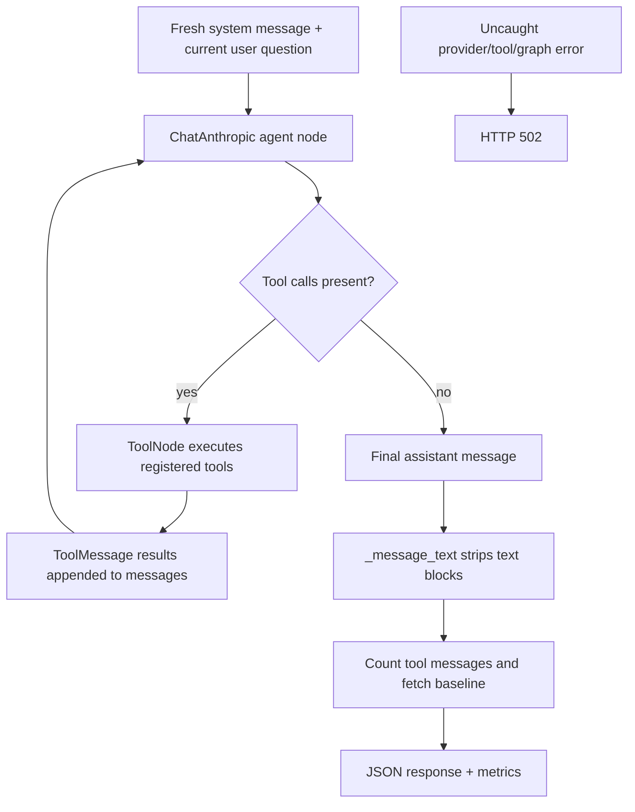

# Parts 14–27 — Application, AI, and engineering audit

[Start here](README.md) · [Master index](CODEGRAPH_ENGINEERING_MASTERY.md) · [Previous](01_FOUNDATIONS.md) · [Next](03_QUESTION_BANK.md)

## Contents

- [14. LangGraph, ReAct and the actual execution loop](#14-langgraph-react-and-the-actual-execution-loop)
- [15. Profiles of all seven registered tools](#15-profiles-of-all-seven-registered-tools)
- [1. query_graph_blast_radius(repo_name: str, function_name: str) -> str](#1-query_graph_blast_radiusrepo_name-str-function_name-str---str)
- [2. list_codebase_structure(repo_name: str) -> str](#2-list_codebase_structurerepo_name-str---str)
- [3. list_functions_in_file(repo_name: str, file_path: str) -> str](#3-list_functions_in_filerepo_name-str-file_path-str---str)
- [4. query_outgoing_dependencies(repo_name: str, function_name: str) -> str](#4-query_outgoing_dependenciesrepo_name-str-function_name-str---str)
- [5. list_external_dependencies(repo_name: str) -> str](#5-list_external_dependenciesrepo_name-str---str)
- [6. semantic_code_search(query: str, repo_name: str, top_k: int=5) -> str](#6-semantic_code_searchquery-str-repo_name-str-top_k-int5---str)
- [7. analyze_architectural_subsystems(repo_name: str) -> str](#7-analyze_architectural_subsystemsrepo_name-str---str)
- [How tools complement one another](#how-tools-complement-one-another)
- [16. Prompt design and trust boundaries](#16-prompt-design-and-trust-boundaries)
- [17. AI architecture decision defense](#17-ai-architecture-decision-defense)
- [18. FastAPI endpoint contracts](#18-fastapi-endpoint-contracts)
- [19. Frontend architecture and React behavior](#19-frontend-architecture-and-react-behavior)
- [20. NDJSON streaming and progress](#20-ndjson-streaming-and-progress)
- [21. Security analysis with actual controls](#21-security-analysis-with-actual-controls)
- [22. Test suite and Postman](#22-test-suite-and-postman)
- [23. Evaluation methodology and answer reliability](#23-evaluation-methodology-and-answer-reliability)
- [24. Performance and scale](#24-performance-and-scale)
- [25. Development history: evidence without invented motivation](#25-development-history-evidence-without-invented-motivation)
- [26. Architectural trade-off matrix](#26-architectural-trade-off-matrix)
- [27. Weaknesses and production-readiness register](#27-weaknesses-and-production-readiness-register)

---

## 14. LangGraph, ReAct and the actual execution loop

The active factory is `_get_code_agent` at `backend/app/agent/graph.py:335`, not root `agent.py`. It creates `ChatAnthropic(model='claude-sonnet-5', api_key=...)` and passes seven decorated async tools to `create_react_agent`. It caches the compiled graph with `lru_cache(maxsize=1)`. Caching a graph object does not cache answers or conversation state. No custom state schema, checkpointer, persistent store, pre-model context hook, structured final response, recursion limit, token budget or timeout is supplied by this application.

ReAct alternates model decisions with actions and observations. Here, an action is a structured tool call, the application executes fixed Python/Cypher behavior, and a ToolMessage carries the observation back to the model. This does not make the model's reasoning visible or trustworthy; intermediate natural language is not independently verified reasoning. The agent can call one or multiple tools, revisit a tool, or stop without any tool. Tool choice is model-dependent; database queries and tool formatting are programmatic.



`_run_code_agent` sends a new system/user pair and `repo_name` to `ainvoke`. The installed prebuilt default state declares `messages` with the `add_messages` reducer and managed `remaining_steps`; it does not declare a custom repository field. Passing a repository key in the input does not bind tool parameters. Effective repository context is in the system text, while each tool still accepts model-supplied `repo_name`. No previous browser messages are sent.

**Version-specific library inspection:** the installed LangGraph 1.2.11 prebuilt implementation uses default version `v2`, dispatching tool calls through its tool execution graph, with message accumulation and conditional continuation. Unknown tool names produce an error ToolMessage. Its default ToolNode handler returns invocation errors but rethrows ordinary execution errors. A Neo4j exception is therefore not guaranteed converted into a recoverable observation. The installed `_internal/_config.py:32` defaults recursion_limit to **10007**, environment-overridable; do not repeat the often-quoted 25-step default as this runtime's configuration. A Pydantic state example separately contains 25, but it is not the default TypedDict graph state used here. The agent factory's remaining-step logic can return a step-exhaustion message when further tool calls cannot proceed. None of this is a project-specific spend policy. These library details were read locally; the full application was not run against a model.

`langchain_anthropic/chat_models.py` in the installed environment declares `max_retries=2`; request timeout and max_tokens are not explicitly fixed by CodeGraph. Model-dependent/library defaults should not be represented as measured deployment behavior. No repeated-call detector, explicit budget ledger or application retry/backoff strategy exists. Empty/missing final messages raise errors; `_message_text` returns string content or concatenated dictionary text blocks, dropping other block types. The code does not verify that a nonempty last message is a grounded answer.

## 15. Profiles of all seven registered tools

All tools are `@tool` async functions. Their type annotations generate argument schemas. They strip inputs, but do not perform the full API's canonical repository validation or authenticated ownership checks. They use parameterized Cypher through an async session and return **strings**—some strings contain JSON. Most have no local catch block; execution failures propagate into library handling. The examples below illustrate output contracts, not an observed live model run.

### 1. `query_graph_blast_radius(repo_name: str, function_name: str) -> str`

Implementation `graph.py:103`; query `CALLERS_QUERY:21`. It matches scoped incoming one-hop CALLS, optionally gathers caller File paths, orders by caller, and limits to 100. JSON string fields are `repo_name`, `function_name`, `target_is_external`, and `callers`, whose rows contain `caller`, `file_paths`, `target_is_external`. Example: `{"repo_name":"demo/repo","function_name":"save","target_is_external":false,"callers":[{"caller":"handler","file_paths":["api.py"],"target_is_external":false}]}`. Blank inputs return an empty caller envelope.

Use for “what directly calls save in this indexed graph?” Do not use to promise all transitive impact, runtime reachability, breakage probability or complete references. No callers means the envelope's external flag is false even when an unconnected target is external, because the flag comes from matched caller rows. Performance follows incoming degree, optional file aggregation, sorting and limit; same-name collisions and inferred edges impair precision. Tests verify formatting/external flag and an optional live test checks cross-repository results. Interview challenge: why is “blast radius” too broad? Because the query has exactly one relationship hop and a result cap.

### 2. `list_codebase_structure(repo_name: str) -> str`

Implementation `graph.py:140`; query `CODEBASE_STRUCTURE_QUERY:32`. Returns sorted File paths joined by newlines, e.g. `src/api.py\nsrc/db.py`; blank scope yields empty text. It has no directory-tree hierarchy, pagination or limit. Use for finding indexed source files and selecting file-scoped queries. Do not describe it as every repository asset: unsupported files and pruned directories never became File nodes. Large repositories produce large tool messages. No filesystem access occurs here; values come from Neo4j. Test `test_list_codebase_structure_returns_newline_separated_paths` checks exact output and query arguments.

### 3. `list_functions_in_file(repo_name: str, file_path: str) -> str`

Implementation `graph.py:162`; query `FUNCTIONS_IN_FILE_QUERY:38`. Inputs are trimmed; empty input gives a no-functions response. It matches scoped File→DEFINES and returns sorted function names. Example: `Functions in src/api.py:\n- handler\n- validate`. No source, signatures, IDs or line ranges are returned. Path is a database selector, not a file-open request. The Function endpoint relies on scoped relationship integrity rather than repeating a repo predicate. Use after structure discovery; avoid assuming a unique overload or that the graph preserves every same-named definition. Test checks formatted function list. Performance scales with defined functions and sort; output is unbounded.

### 4. `query_outgoing_dependencies(repo_name: str, function_name: str) -> str`

Implementation `graph.py:194`; query `OUTGOING_DEPENDENCIES_QUERY:45`. Matches scoped caller→CALLS→target, returning name, legacy `file`, and `is_external`. It formats `Outgoing dependencies for handler:\n- save (db.py)\n- print (External/Built-in)` or a no-results message. It does not query imports, build dependencies, package manifests or transitive paths. A null path becomes “unknown file.” Use for a first-hop graph dependency hypothesis; verify actual caller ownership before claiming execution. The legacy `file` may conflict with newer stored `file_path` after collisions. No row limit; high out-degree inflates context. Tests check internal/external formatting and scope arguments.

### 5. `list_external_dependencies(repo_name: str) -> str`

Implementation `graph.py:236`; query `EXTERNAL_DEPENDENCIES_QUERY:54`. Returns all sorted ExternalFunction names, e.g. `External dependencies:\n- get\n- print`. Blank/empty results return no-dependency text. “External” means no stored DEFINES edge, not a verified package source or third-party dependency. A missed local definition can be external; two unrelated libraries' `get` methods can collapse. Use to identify unresolved targets for investigation, not generate a software bill of materials or vulnerability report. It never resolves package versions. Output is unbounded and scope is model supplied. Tests assert formatting and query scope.

### 6. `semantic_code_search(query: str, repo_name: str, top_k: int=5) -> str`

Implementation `graph.py:266`; query `SEMANTIC_CODE_SEARCH_QUERY:60`. Trim query/scope; blank returns no matches; k clamps to 1–20. Generates an OpenAI query embedding and runs global vector SEARCH, then filters by repository. Example: `Semantic code matches for "payment validation":\n- validate (payments.py) — similarity 0.8123`. Non-numeric/missing score renders unknown. It returns metadata, not code or certainty. Use when the exact symbol is unknown; exact identifiers often deserve direct lookup. It incurs embedding network usage and ANN latency; repeated queries are not cached. Tests mock embedding/database and assert modern SEARCH syntax, parameters and formatting, not live ANN recall or database syntax compatibility.

### 7. `analyze_architectural_subsystems(repo_name: str) -> str`

Implementation `graph.py:317`; query `ARCHITECTURAL_SUBSYSTEMS_QUERY:74`. Returns JSON array with `id`, `module_title`, `module_description`, `function_count`, ordered by count descending. Example: `[{"id":3,"module_title":"HTTP handling","module_description":"Groups request helpers.","function_count":12}]`. Blank scope yields `[]`. Despite “largest” in the docstring, no LIMIT exists. Use for high-level summaries as directed by the prompt. It does not recompute Leiden, select a query-relevant subgraph, fetch members' bodies or validate labels. Cost scales with communities/membership aggregation; stored labels may be stale or misleading. Tests mock rows and verify scoped query/JSON.

### How tools complement one another

A plausible sequence for “where is payment validation and who depends on it?” is semantic search → functions in the returned file → direct callers → outgoing dependencies. Claude then summarizes those observations. This is an illustrative possible tool trace, not deterministic routing. Because tools supply no canonical entity IDs, name collisions can make the second and later steps ambiguous. A user can inspect source separately in the UI; the agent cannot call the source endpoint through its registered tool list.

For “explain the architecture,” the prompt specifically asks the model to use community summaries. It may additionally request structure or dependency lists, but nothing enforces that behavior or checks that the label matches actual code. If it chooses the wrong tool, there is no automatic relevance grader; it can recover by choosing another tool or produce an unsupported answer.

## 16. Prompt design and trust boundaries

`CODE_AGENT_SYSTEM_PROMPT` at `graph.py:84` asks for readable Markdown, concise headings/lists, code formatting, use of the exact repository name, and the architecture tool for architecture questions. It does **not** require citations, source inspection, calibrated uncertainty, a minimum number of tool calls, answer validation or explicit abstention. The older root prototype's “base claims on tool results” instruction must not be attributed to the active prompt.

Tool descriptions advertise narrowly named capabilities, but the model may interpret “blast radius,” “external dependency,” and “architecture” more strongly than their implementations justify. Improving names/descriptions to disclose one-hop limits, name ambiguity and file-scope provenance could reduce overclaiming, but would not fix graph data errors. A system instruction is intended control; a user question is the requested task; tool output is evidence; repository text/names are untrusted data. These are distinct trust levels even when combined in the same model context.

Current exposure is narrower than “the agent reads every malicious README”: Markdown files are not indexed, function source is not sent through current graph tools, and community labeling receives names/paths. Nevertheless adversarial paths, names, generated labels or user text can influence model behavior. The model also chooses repo_name tool arguments. There is no request-bound allowlist preventing cross-scope reads, and the active prompt is not a security boundary. No general shell/browser/write tool is registered, limiting direct effects, but text leakage and misleading answers remain possible. Future source retrieval would expand the prompt-injection surface and should use strict authority separation plus enforceable tool authorization.

## 17. AI architecture decision defense

A defensible current rationale is that different questions need different evidence: file lists for orientation, neighbors for dependencies, vectors for fuzzy intent, labels for modules. LangGraph handles message accumulation, tool schemas, execution and continuation without hand-writing those mechanics. Claude supplies language generation and tool choice; OpenAI supplies separate embedding and label endpoints. The source establishes these choices but does not establish a controlled comparison of providers or that the developer personally evaluated all alternatives.

Direct LLM calls could support a fixed retrieval-and-answer pipeline with less orchestration. A custom loop would expose budgets and scope injection explicitly but require maintenance of tool-call validation and errors. Other frameworks offer similar abstractions with different debugging/dependency costs; no historical bake-off is recorded. Deterministic routing is preferable for exact graph requests, while an agent is more useful for open-ended exploration requiring several data views. A hybrid could implement exact “callers of X” deterministically and use an agent for broad questions, with authorization and budgets enforced outside the model.

The biggest reliability gain would come from improving data identity and provenance before changing models. A stronger language model cannot reconstruct relationships never captured or distinguish definitions already merged into one node. Provider changes need actual task evaluation, operational cost and timeout/retry measurements, not generic “best model” claims.

## 18. FastAPI endpoint contracts

All active routes reside in `backend/app/main.py` except the webhook router. Default success/error envelopes are ordinary JSON; ingestion is the exception. No application authentication/authorization protects graph/chat/source/ingestion/deletion. CORS permits localhost:3000 and localhost:5173 with credentials/all methods and headers; that is browser access policy, not identity verification.

| Method/route and source | Request and validation | Result, service work and failures |
|---|---|---|
| GET `/health`, `main.py:544` | None | 200 `{status:'ok'}`; no dependency probe. If startup itself fails, a newly launched process may never reach serving state. |
| GET `/api/graph`, `:209` | optional repo_name; normalize if present | Missing scope returns empty graph without DB. Otherwise nodes/edges JSON; 422 invalid scope; 503 auth/unavailable DB; 500 Neo4j query errors. |
| GET `/api/node/{node_id}/code`, `:248` | nonblank ID and required normalized repo_name | 200 `{code,file_path,name}`; 404 no node; 422 invalid input; 503 DB auth/unavailable; 500 query errors. Reads source only, no LLM. |
| POST `/api/ingest-repo`, `:520` | `{url}` length 1–2048 and nonblank; HTTPS GitHub two-part path | Pre-stream 422 invalid URL. Otherwise 200 x-ndjson; download/parse/DB/embedding/GDS/labels in stream. Runtime errors appear inside records, not a revised status code. |
| POST `/api/chat`, `:349` | `{message,repo_name}`; message 1–10000/nonblank, repo 3–201/canonical | 200 `{response,metrics}`; fresh agent call then baseline read; broad exception → 502. No server token stream. |
| DELETE `/api/repositories/{repo_name:path}`, `:335` | path captures owner/repo then canonical validation | 200 `{status:'success',repo_name}` even already empty; 422 invalid; 503 auth/unavailable; 500 DB errors. |
| DELETE `/api/repo`, `:328` | JSON `{repo_name}`, same normalization | Same delete operation, intended for browser keepalive cleanup; not a separate retention policy. |
| POST `/api/webhooks/github`, `api/webhooks.py:22` | raw bytes HMAC header dependency, event header, JSON object | 202 accepted and in-process BackgroundTasks; 401 missing/invalid signature; correctly signed bad/non-object JSON → 400. |

Pydantic validates requests before handlers. Field length constraints and trim validators should not be confused with semantic authorization. Error details are strings for explicit HTTPException paths and often arrays for schema validation; `api.js:3` handles both.

Neo4j has two clients: a synchronous module-level driver verifies connectivity on import, supports index initialization and a session dependency; active async APIs use a lazy async driver from `db/__init__.py`. The sync `get_db_session` dependency exists but is not the principal session mechanism for current routes. Startup runs sync index initialization in `to_thread`, deletes all scoped data asynchronously, yields to serving, then closes both drivers on shutdown. The initialization flag is process-local; multiple workers do not coordinate through that lock.

Async I/O avoids blocking the event loop for network/database waits. Directory discovery and parsing are offloaded. JSON construction, list flattening, token-context counting after agent completion, and some cleanup are synchronous work inside request flow. A BackgroundTask is not a durable queue: it runs after response in the process and can disappear on crash. Many concurrent ingestions independently allocate buffers/task arrays and write to the same database; there is no global admission controller.

## 19. Frontend architecture and React behavior

`main.jsx` mounts `App` directly; no router, Redux/Zustand store, authentication layer or server state cache exists. `App` owns nodes/edges, repository selection, graph/ingestion/error/loading states, messages, chat input, active clusters, hover focus, source selection and maximize state. `CodePanel` owns fetched source/loading/error; `GraphLegend` owns description expansion. `useMemo` computes adjacency, degrees, legend and styled arrays; `useCallback` stabilizes handlers; refs track AbortController, React Flow instance and DOM elements.

`normalizeNodes` merges top-level/data fields, chooses File versus Function node types, extracts community metadata and sets initial zero positions. `normalizeEdges` creates directed arrows. `applyForceLayout` uses link, repulsion, center and collision forces, manually ticks **300** times synchronously, then converts center positions into top-left coordinates. Node sizes scale with degree. The backend's initial grid positions are overwritten. Edges are routed to nearby cardinal handles. React Flow supplies zoom/pan/controls/minimap and supports custom memoized node components.

The backend limits graph rows to 200; the frontend does not progressively fetch more nodes. It processes all returned nodes and edges. Cluster “filtering” and hover focus mostly change opacity, color and animation; they do not remove all dimmed nodes from computation/rendering. Hover adjacency is built in both directions, while arrows retain edge direction. Legend counts reflect the loaded subset, not authoritative full-repository community size. Source selection works only for Function nodes and fetches by Neo4j element ID plus repo scope. Displayed code line numbers start with the snippet, not stored original file line offsets, because those offsets are not persisted/exposed.

`submitRepository` aborts the previous tracked request, clears graph/scope/filter state, consumes progress and sets activeRepo on completion, then loads the graph. The graph fetch has no signal or request-generation check. A slow earlier fetch can overwrite state after a newer request, and refresh/delete races are not fully guarded. The shared abortRef is reused for chat and ingestion; chat's finalizer clears it unconditionally, unlike ingestion's identity check. Aborting a previous chat while starting ingestion can therefore lose the new controller reference. This is a source-based race scenario, not a reproduced browser bug.

`CodePanel` aborts old source requests on selection/scope change and unmount; it suppresses abort errors and only clears loading if not aborted. This is better cancellation isolation than graph fetching, though resolution races still deserve component testing. Popover and resize listeners/timers have cleanup; chat scrolls to the latest message. Beforeunload sends best-effort DELETE using relative `/api/repo`; Vite proxies it locally. Most other requests use hard-coded `http://localhost:8000`. Production hosting would need coherent API configuration/proxying.

Chat displays local message history with ReactMarkdown+GFM; backend history is not sent. JSON branch extracts only payload.response and does not display metrics. A compatibility SSE parsing branch exists but active backend chat returns JSON. No assistant-to-graph references/navigation contract exists. Markdown function names do not automatically select nodes. React Flow is appropriate for interactive custom nodes, but D3 alone, Cytoscape or canvas/WebGL could suit larger graphs; selection should follow measured interaction/rendering needs, not library prestige.

## 20. NDJSON streaming and progress

NDJSON is a sequence of individually valid JSON records separated by newlines. A streaming transport chunk need not equal one record: one line can span chunks and a chunk can contain several lines. `main.py:370` uses compact JSON plus newline. `StreamingResponse` advertises `application/x-ndjson`, disables caching and asks reverse proxies not to buffer via `X-Accel-Buffering:no`.

`api.js:32` checks the initial HTTP response, obtains a reader, incrementally decodes UTF-8, appends to a buffer, splits CRLF/LF, keeps the unfinished tail, and parses complete lines. At EOF it processes the remaining buffer. It invokes onProgress for numeric progress, throws on payload.error, remembers progress=100, and requires a final nonblank repo_name. It does not independently enforce monotonic progress or validate every record's schema as strictly as Postman. It also lacks an explicit reader cancel/release finally block. The fetch signal supports abort, but it does not guarantee rollback/server cancellation.

```mermaid
sequenceDiagram
 participant S as Ingestion generator
 participant H as HTTP stream
 participant D as TextDecoder and buffer
 participant R as React state
 S->>H: JSON line + newline
 H->>D: arbitrary byte chunk
 D->>D: decode incrementally; preserve partial line
 D->>R: parsed numeric progress/status
 S->>H: terminal error OR progress 100 + repo_name
 D->>R: throw visible error OR activate repository
 R->>H: fetch graph after successful completion
```

Progress values are stage allocations: 10 download, 20 downloaded, parsing 20–80 proportional to file completion, 85 batching, 86 files, 90 function embeddings/writes, 94 calls, 97 Leiden, 98 labels, 99 finishing, 100 done. They are not calibrated elapsed-time predictions; one large file or slow labeling call can dominate. Failed file parses still advance file completion.

NDJSON fits POST-with-body and one-way progress with a simple parser. SSE standardizes event framing/reconnection but browser EventSource normally makes GET requests; fetch can consume POST SSE manually. WebSockets provide bidirectional long-lived communication but add connection/session management. Polling requires persisted status; current jobs have no IDs. Long polling retains requests without a continuous record stream. gRPC streaming would require a browser-compatible gateway/client design. If bidirectional pause/resume were needed, first persist job state; changing transport alone would not make work durable.

## 21. Security analysis with actual controls

Threat model: untrusted users can submit repository identifiers/questions or contact exposed APIs; repositories and provider responses can contain adversarial data; network services may fail; concurrent clients may share a scope. The current product is a local prototype, not an authenticated multi-tenant service.

| Control/evidence | Prevents or reduces | Does not establish; investigation/improvement |
|---|---|---|
| HTTPS GitHub host validation, `main.py:139`; fixed reconstructed URL | Arbitrary user URL fetch through this endpoint | Redirect behavior and naming edge cases still matter; enforce network egress policy for production, test redirect destinations. |
| Resolved archive-member containment, `github_service.py:38` | Ordinary `../` and absolute path escapes | No ZIP bomb/disk/member limits or explicit special-file policy; bound archive bytes/ratio/count and test hostile fixtures. |
| Parser-only source handling | Repository code is not imported/executed as an ingestion step | Native parser/resource vulnerabilities possible; isolate resource use, keep packages pinned/patched. No CVE scan was run. |
| Cypher parameters | Repository/function text not interpolated as executable Cypher | Does not prevent expensive queries or unauthorized valid scopes. |
| Scope predicates | Reduces accidental cross-repository mixing | No user ownership, branch separation, case normalization or server-bound tool scope. Add principal→repository ACL checks and injected tool scope. |
| Bulk graph source/vector omission, `db/__init__.py:98` | Smaller responses, less unnecessary source distribution | Source endpoint deliberately returns source with no auth; metadata itself can be sensitive. |
| HMAC dependency, `api/dependencies.py:9` | Requests without the shared secret cannot normally forge valid body authentication | No freshness/replay/delivery-ID check; event header is outside body HMAC; shared/default secret strength matters. |
| `.gitignore` and backend env | Keeps typical local secret files untracked | Compose/prototype have checked-in development credentials; not an encrypted secret store or rotation mechanism. |
| Localhost CORS list | Limits browser JS reading from other origins | Direct HTTP clients bypass CORS; no authentication or authorization. |
| Narrow read-oriented tools | Model has no shell or arbitrary database write tool | Wrong-scope reads and misleading text remain possible; semantic tool creates paid provider usage in normal operation. |

HMAC combines a secret key with a hash construction, conceptually `H((K xor opad) || H((K xor ipad) || message))`. CodeGraph uses SHA-256 over the exact raw request body bytes with the shared webhook secret, hex-encodes it and prefixes `sha256=`. The server reads raw bytes before JSON parsing and uses `hmac.compare_digest` to avoid ordinary early-exit comparison leakage. Missing/invalid signature yields 401 before the handler; correctly signed malformed JSON yields 400 after authentication. HMAC authenticates integrity and secret possession, not encryption, user identity, freshness or processing completion.

A replay of the same signed event can be accepted repeatedly because no delivery ID/timestamp is recorded. Even honest retries can repeat merge/enrichment work. Header `X-GitHub-Event` is used to select processing but is not part of the body digest. Authorization should bind accepted webhook repositories and event policies independently. Current tests for the active webhook are in Postman definitions; the root Pytest webhook tests target the legacy endpoint.

Prompt injection should be assessed at the actual data boundary: current agent tool outputs are metadata/labels, not arbitrary whole repository prose. Names and labels remain untrusted. Scope and budgets must be enforced in code, because a prompt saying “use this repository” cannot stop a model from passing another string. A future source tool should expose immutable source references, cap content and require every requested scope to match the authenticated request.

No user rate limit, global ingestion cap, archive quota, LLM spend budget, row budget on most tools, tenant quotas, audit trail or destructive-action authorization exists. Multi-worker startup cleanup and browser unload can delete another session's shared scope. Production work would need retention policy, tenant IDs, immutable snapshots, access checks on every read/write, separate service credentials, limits and monitoring. These are concrete gaps evidenced by current routes, not a claim that exploitation was attempted.

## 22. Test suite and Postman

| Active test module | Cases | Main assurance and boundary |
|---|---:|---|
| test_agent_tools.py | 11 | Formatting, scoped query parameters, seven registrations, tool-only metrics; model/DB mocked. |
| test_community_summarizer.py | 3 | Structured label request and atomic delete/store callback; generated meaning not evaluated. |
| test_database_initialization.py | 1 | Index queries/await executed once via mock; no live index plan. |
| test_embedding_service.py | 3 | Batch response reordering, singleton delegation, blank rejection; no real model vector quality. |
| test_function_identity.py | 19 | Distinct paths/classes/overloads, stable IDs, lexical ownership, anonymous boundaries, invalid paths and multi-language metadata. |
| test_gds_ops.py | 6 | Project/write/drop ordering, modern query text, cleanup attempt on failures, empty/blank scope; no real partition quality. |
| test_graph_scoping.py | 10 | Cypher predicates, batches, raw source, baseline and external tagging; mostly string/mock assertions. |
| test_graph_serialization.py | 3 | Community aliases/labels and exclusion of raw_code/embedding. |
| test_ingest_repo.py | 5 | URL parsing, suffix discovery, progress/relative paths/cleanup, rejected host, ZIP lifetime via fake HTTP. |
| test_parser_service.py | 14 | Seven extension fixtures, raw snippets, per-file failures, unreadable files and progress; token counter mocked. |
| test_pipeline.py | 11 | 7 mocked API cases; 4 optional database integration cases. |
| test_repository_deletion.py | 7 | Scoped delete queries, startup lifecycle, API validation and browser delete contract; mocked DB/lifespan. |
| test_tokens.py | 3 | Encoding selection/cache/fallback/input validation with mock encoders. |
| **Total** | **96** | **92 passed and 4 skipped in this audit.** |

The earlier “82-case” claim does not describe HEAD. README records 77 tests passing on 2026-09-16, or 73+4 skips offline; HEAD adds 19 identity cases, yielding 96. That historical live result is DOCUMENTED, not reproduced here. Root `tests/test_webhook.py` has two tests for `/webhook/github`, a different API, and was not included in the active-backend count.

Important assertions: identity tests distinguish `A.validate` from `B.validate` and Java overload signatures; call tests keep nested/anonymous ownership separate; ETL tests check transactions for 205-record inputs; GDS tests ensure a drop is attempted when projection consume or algorithm fails; ingestion tests check the exact progress sequence and cleanup; serialization tests exclude raw bodies/vectors; agent metrics test uses a mocked trace and mocked token count. A passing mock test proves the requested interaction, not that Neo4j accepts syntax or Claude chooses the right tool. No active native test verifies the full signed webhook pipeline, rate limiting, same-scope races, ZIP bombs, full-browser interactions, live vector recall, real Leiden quality or answer truth.

Postman is a source-controlled Collection v2.1 with four folders and **23 requests**: standalone health (1), repository workflow (7), validation/failures (9), webhook cases (6). Its environment supplies base_url, a small public example repository, dynamic collection variables and a private webhook secret placeholder. Provider/database credentials stay on the backend. Scripts are executable API-contract definitions; they were inspected, not run against live services during this audit.

**Seven-step journey:** health resets active_repo_name/ingestion_total_tokens/function_node_id/function_name; ingestion parses NDJSON, rejects any error property, verifies finite monotonic 0–100 progress, captures terminal canonical scope/baseline; graph requires arrays/nonempty nodes, recursively rejects bulk raw_code/embedding and picks an internal Function; source uses its ID/scope and checks strings/name; chat requires nonempty answer and arithmetically consistent metrics; DELETE removes the selected scope; final GET requires empty nodes/edges and clears state. The source assertion requires `code` to be a string, not necessarily nonempty. Happy-path ingestion script does not itself assert x-ndjson content type, although the failure case does. These are useful distinctions between intent and exact assertions.

Negative requests cover insecure/non-GitHub URL, malformed graph scope, stream error despite HTTP 200, missing chat scope, unknown source 404, repeated synthetic-scope deletion, and manual browser cleanup. HMAC folder signs exact raw UTF-8 bytes with Web Crypto, with CryptoJS fallback; cases are valid benign ping, missing signature, corrupted signature, signature for different bytes, signed malformed JSON, signed non-object JSON. A valid ping avoids meaningful ingestion; 202 is acknowledgement only. The collection has no durable webhook completion test, sleeps or quality scoring. Runner assertions may fail without stopping later requests, so a failed chain can still reach deletion. This audit did not run those mutating/provider-backed workflows.

## 23. Evaluation methodology and answer reliability

Current quantitative output is a token comparison and logged counts/community modularity. There is no formal dataset measuring retrieval precision/recall, grounding, hallucination frequency, answer accuracy, tool-selection accuracy, tool success rate, cost or latency distributions across repositories/languages. Unit tests on metric arithmetic cannot fill that gap.

**Proposed controlled evaluation:** select fixed repository SHAs across all supported languages and several sizes. Have independent reviewers label questions about entry points, caller ownership, exact behavior, architecture and unsupported/ambiguous cases. Store gold file/function/range evidence, acceptable claims, deliberately unanswerable questions and expected uncertainty. Include duplicated function names, polymorphism, generated code, callbacks, sparse names and adversarial metadata. Separate development questions from held-out evaluation questions.

Compare five systems at the same model/version and answer budget: full-source prompt; vector-only metadata or explicitly separated code-vector variant; graph-only deterministic retrieval; graph+community summaries; current multi-tool agent. Keep the current graph and an improved identity/call graph as separate experimental factors, otherwise changes in graph correctness get misattributed to Leiden. For the Leiden ablation, hold parser/index/model/question set and context budget fixed; enable or disable community summaries/selection as the only change. Current CodeGraph does not implement member expansion, so an experimental expansion pipeline must be labeled as a different system.

Report retrieval precision@k, evidence recall@k, source coverage, ranking quality, fraction of unsupported material claims, contradiction rate, answer correctness, appropriate abstention, tool argument/scope correctness, invalid-call rate, per-stage p50/p95 latency, billed provider usage and preprocessing cost. Human judges should be blind to system variant; adjudicate disagreements. Automated judging may assist but needs calibration against humans. Repeated runs measure stochastic variation. Bootstrap confidence intervals over repository/question clusters are more informative than one impressive example.

A claim-level grounding evaluator checks whether each material assertion follows from cited source at the evaluated SHA. It must distinguish “graph says A calls B” from “source proves A calls B”; the former can be true of an inaccurate graph. A source miss should reduce evidence recall and trigger uncertainty; the current agent may instead confidently answer incorrectly. Production metrics should combine operational failures/latency/spend with sampled answer audits, privacy-safe traces and user correction signals. More context can improve recall but add distracting or contradictory evidence; evaluate a quality-versus-context curve rather than optimizing percentage reduction alone.

Interview answer: “I know selected parser and API behaviors pass tests. I do not yet have evidence that arbitrary agent answers are accurate. I would build a fixed-SHA, source-labeled evaluation set and compare variants at matched budgets. The agent can be confidently wrong, especially when graph identity or retrieval is incomplete.”

## 24. Performance and scale

No measured ingestion/LLM/query throughput benchmark exists. The following are source-based bottleneck hypotheses; the frontend build size is the main current measured artifact.

| Stage | Growth driver and current design | Practical next measurement/improvement |
|---|---|---|
| Download/extract | Full archive bytes in RAM; extraction plus disk writes | Count compressed/expanded bytes, bound both, stream download to controlled storage. |
| Discovery/read | All paths/tasks retained; full file bytes | Per-file/total budgets and fixed work queue. |
| Parsing | Bytes, query captures, lexical C×F candidate checks; per-language locks | Profile by language/file size, optimize interval ownership and evaluate parser-per-worker. |
| ETL | Sum of unique functions×unique call targets per file | Replace Cartesian call attribution; measure edge inflation versus source call sites. |
| Database | Batches of 100, repeated MERGE/index lookups | Measure transaction latency, contention and cardinality; enforce identity constraints. |
| Embeddings | One request per function batch, no cached results | Content/model hash cache; code-aware input evaluation; provider batching/rate policy. |
| GDS | Full scoped graph projection plus algorithm memory | Estimate projection memory and time; reduce spurious edges; immutable per-run names. |
| Labels | One sequential model request per community | Cache stable summaries; bounded concurrency; optional degradation when labels fail. |
| Graph retrieval | Collect scoped graph then LIMIT 200 rows | Cursor/targeted neighborhood API; inspect plans; do not merely raise LIMIT. |
| Agent | Variable tool rounds; unbounded lists; repeated prompt history | Enforce step/time/token budgets and tool result bounds; capture actual usage. |
| Browser | 300 synchronous force ticks + React Flow nodes/edges | Profile main-thread long tasks; worker layout/canvas/level-of-detail as needed. |

For millions of lines, full buffering, same-language serialization, call-row explosion, embeddings and full GDS projection are likely pressure points. For hundreds of users, per-request bounds do not bound total work; shared repository keys and cleanup are a correctness problem before raw throughput. Multiple repositories per user require user identity and ownership, not merely multiple repo_name strings. Enterprise monorepos need configurable excludes, language coverage and compiler/type integration where precision matters, plus snapshot-aware references and targeted graph retrieval.

Caching opportunities are distinct: clients/compiled agent/encoders are cached today; parsed outputs, embeddings, query results and community computations are not reused by content hash. Persisting active graphs would enable amortization, but startup and unload deletion undermine it. Proposed scaling sequence: fix identity and call provenance; make jobs/snapshots durable; add authorization and quotas; measure stage budgets; add caching; distribute only bottlenecks justified by measurements. A distributed flawed call graph is still flawed.

## 25. Development history: evidence without invented motivation

The available history has 33 commits, 2026-08-16 through 2026-09-23, attributed to Aansh Singh. Dates and author metadata are history facts; they do not establish who typed each line or what alternatives were personally evaluated.

| Milestone | Before → change; continuing significance and evidence |
|---|---|
| `6918655` initial, Aug 16; `d03c176` webhook, Aug 17 | Root Python parser/database/one-tool agent and webhook prototypes establish an earlier architecture. Current root API still differs and includes SSE/PR-file behavior absent from active backend. |
| `ad3ec25`, `febafa8`, Aug 17 | Connection/sync fixes recorded by commit subjects; no incident timeline or comparative performance result accompanies them. |
| `ec8dee2`, `a8ccd49`, Aug 17–18 | Graph UI evolution; later App retains custom rendering/layout. |
| `0d1692c`, `1397f03`, Aug 18 | GitHub full repository ingestion and synchronization path replace purely local/manual graph preparation. Current default-branch downloader remains. |
| `930d2a3`, `6f49012`, Aug 18 | Tool expansion and external-function handling; final registration grew further with semantics/architecture. |
| `15b8962`, `4ff44cd`, Aug 18 | Dynamic ingestion/progress changes lead to NDJSON UI path. No timing evidence proves perceived/actual speedup. |
| `e014d9e`, Aug 18 | Micro-batched three-pass writes/index initialization. Diff also changes Function key from name+file+repo to name+repo: fewer split targets but increased same-name conflation. Tests were added for batching/indexes, not proof of collision-free semantics. |
| `d0e5f5f`, Aug 19 | Prompt readability changes; final prompt emphasizes Markdown. |
| `e2cda94`, Aug 19; `4a173a3`, Aug 22 | Multi-language grammars and Java corrections. Current query fixtures test selected language constructs. |
| `2c8d2bf`, Aug 20 | Cleanup lifecycle; current behavior includes startup-wide scoped deletion and best-effort unload cleanup. Subject alone should not be read as exact final timing. |
| `d3ec9ab`, Aug 20 | Metadata embeddings and semantic tool introduced. No accuracy comparison recorded. |
| `078c163`, Aug 21; `77d357d`, `6319d2d`, `05f89ad` | Leiden integration followed by plugin/container/label fixes. Current modern Cypher projection and finally cleanup reflect compatibility work. |
| `3c963ac`, `c011222`, Aug 21; `6822eef`, `3a1b28f`, Aug 22 | Community descriptions and filter UI evolve into legend and dimming controls. |
| `47f0049`, Aug 23 | Token accounting across ingestion/chat plus lazy source inspection; tests use mock counts. No 737k/18k experiment was committed. |
| `8d1c3a4`, Aug 23 | Vector query migrates from procedure to SEARCH. Current syntax requires compatible server/Cypher configuration. |
| `a529636`, Aug 26; `abd6f25`, Aug 31 | Fullscreen UI and README overhaul. README remains partly stale about parser-only improvements. |
| `9546f58`, Sep 16 | Environment docs/Compose/example adjustments; README records historical 77-pass result. Backend dependencies remain unpinned and current saved venv was incomplete. |
| `17d36c0`, Sep 16 | Adds Postman collection/environment/workflow documentation with dynamic chaining and HMAC scenarios. No permanent CI runner added. |
| `79fa768`, Sep 23 | Parser identity/call ownership foundation and CG-002 handoff; no persistent schema migration. Adds 19 identity test cases. |

History provides concrete before/after code for identity and batching. Most commit subjects do not document rejected alternatives, debugging sessions or raw test outputs. Where none exists, this manual gives a current engineering rationale, not a fabricated development story. `CG-001-architecture-investigation.md` describes the pre-HEAD parser gap and proposes follow-on work; `backend/FUNCTION_IDENTITY.md` is the newer parser contract. Its explicit “not persisted” statement agrees with the source.

## 26. Architectural trade-off matrix

All alternatives below are analysis, not claimed historical deliberations. Each row should be defended against actual requirements.

| Choice | Benefit/problem addressed | Costs in performance, reliability and maintenance | Prefer an alternative when… |
|---|---|---|---|
| FastAPI vs Django/Flask | Typed request validation, async APIs and streaming | Async/sync boundaries and lifecycle remain developer responsibilities | Django's integrated auth/admin/data model matters more; a tiny Flask service needs little async work. |
| Python vs Go/Java/TypeScript | Parser/AI/Neo4j ecosystem in one backend | CPU work/GIL, unpinned packages, runtime typing | Measured throughput or organization ecosystem favors compiled services or shared TS types. |
| Neo4j vs PostgreSQL | Cypher graph queries + vectors + GDS together | Plugin/query-version coupling and extra service operation; no automatic tenancy | Work is mostly simple joins/transactions and relational auth/constraints simplify the system. |
| Graph vs relational model | Relationships first-class, algorithms easier to express | Must model identity and invariants explicitly | Graph structure provides little benefit over indexed association tables. |
| Tree-sitter vs regex | Syntax-aware spans across languages | No symbol/type resolution; grammar/version care | A narrowly scoped textual scan needs only matching, not syntax relationships. |
| Tree-sitter vs compiler/LSP | No build needed for exploratory syntax | Cannot prove overload/import/dispatch targets | Precise refactoring/call resolution is required and language-specific setup is acceptable. |
| React Flow vs D3/Cytoscape/WebGL | Custom React nodes and familiar interaction controls | DOM/layout work and main-thread force simulation | Large graph size or specialist algorithms demand other rendering/graph primitives. |
| LangGraph vs custom loop/direct call | Tool/message orchestration with little code | Dependency defaults, state complexity, weak app-level budgets | A fixed retrieval path is sufficient or exact control outweighs framework convenience. |
| Agent vs deterministic pipeline | Open-ended question decomposition | Variable latency, wrong tools and unsupported prose | The operation is exact and predictable, such as direct callers of a known ID. |
| Vector vs keyword | Fuzzy intent matching | Metadata-only ambiguity, ANN misses, embedding spend | Exact identifiers/errors dominate and lexical precision matters most. |
| Graph-RAG vs vector RAG | Combines relationship/architecture evidence | Graph inaccuracies propagate; more preprocessing | Text evidence alone solves the evaluated questions at lower total cost. |
| Leiden vs traversal/Louvain/components | Topological grouping beyond reachability | No semantic module guarantee, nondeterminism and projection cost | Need direct dependencies, connectivity or ranking rather than community partitioning. |
| NDJSON vs SSE/WebSocket | Simple POST progress records | Manual framing, no replay/status model | Standard reconnection events or bidirectional control is actually needed. |
| OpenAI embeddings vs local/code model | Existing async integration, compact fixed vectors | External data flow, provider dependency, no evaluation advantage proved | Privacy/offline constraints or a benchmark supports a different model. |
| Claude vs other model/provider | Configured tool-capable generator | External API latency/cost, model-string availability not tested | Matched task evaluation supports better quality/cost/operational fit elsewhere. |
| Postman vs pytest/httpx/Newman/CLI | Shareable external workflow and HMAC setup | Stateful/live dependencies, mutable scopes, runner continuation behavior | Unit logic, browser interactions, CI precision or load tests are the objective. |
| 100-record batches vs one transaction | Smaller retry/write units | Visible partial state across commits | Snapshot publication or modest-size all-or-nothing updates are required. |
| Ephemeral graphs vs retained snapshots | Simple session cleanup intent | Restart/unload data loss and poor cost amortization | Multiple users, history or repeated repository analysis is required. |

## 27. Weaknesses and production-readiness register

| Concern/status/evidence | Trigger and impact | How to investigate | Proposed remedy and trade-off |
|---|---|---|---|
| Confirmed identity mismatch, `graph_ops.py:55` | Same name in files/classes/overloads merges distinct functions, mismatched code/path | Disposable duplicate-name graph fixture and read-back | Persist canonical IDs/constraints; migrate every reader/tool/edge, not just write key. |
| Confirmed file-scope CALLS, `:178` | Every function gains unrelated calls; false impact/community evidence | Compare lexical calls and ETL rows for small snippets | Store caller IDs and unresolved call-site entities; resolution work increases schema complexity. |
| Confirmed no auth, route definitions | Any reachable client names another scope or deletes it | Isolated multi-user access tests | Principal-bound ACLs/tenant keys; lifecycle/auth integration cost. |
| Confirmed tool scope not injected, `graph.py:394` | Model-selected repository can differ from request | Mock malicious tool arguments | Bind scope outside model schema; reject mismatches, maintain tests across tools. |
| Confirmed non-atomic replacement, `graph_ops.py:278` | Mid-ingest/provider failure loses old complete scope | Failure injection after each stage | Versioned staging and atomic activation; more storage/cleanup. |
| Confirmed shared GDS name, `gds_ops.py:74` | Same-scope concurrent projection collision | Concurrent disposable job test | Per-snapshot names and locking/ordering; coordination overhead. |
| Confirmed startup-wide deletion, `main.py:66` | Restart/new worker deletes active user data | Inspect lifespan; do not test against valuable DB | Retention policy and explicit GC; job/snapshot lifecycle complexity. |
| Confirmed incomplete webhooks, `pipeline.py` | Deleted/renamed definitions and calls remain; refs mixed | Push removal/rename/multi-ref fixtures | Complete reconciliation/dedup/order; durable queue/storage. |
| Confirmed metadata-only vectors, `graph_ops.py:208` | Generic names hide behavior | Source-labeled semantic benchmark | Include selected code/docs; larger index/privacy/context costs. |
| Confirmed vector post-filter, `graph.py:60` | Other repositories occupy global k | Two-scope ANN dataset and query plan | In-index filters or scoped candidate strategy; version/index migration. |
| Confirmed no grounding validator, prompt/run | Confident unsupported answer | Claim-level source audit | Validated source references and abstention; extra retrieval/latency. |
| Confirmed graph row cap, `db/__init__.py:31` | Missing displayed nodes/edges, misleading counts | Compare DB counts to payload | Pagination/neighborhood endpoint; more client state and consistency work. |
| Inferred resource exhaustion, downloader/parser | Large archives/files/tasks/call products | Bounded synthetic load in disposable environment | Quotas and queues; rejected workloads and configuration burden. |
| Inferred frontend race, `App.jsx:808/1058` | Old graph response or finalizer corrupts newer state | Deferred fetch tests and browser scenarios | Request generation tokens/separate controllers; more lifecycle logic. |
| Confirmed no benchmark/eval artifacts | Cannot defend accuracy/latency/context percentage generally | Build fixed-SHA evaluation suite | Ongoing labeled data and review cost. |
| Confirmed reproducibility gaps | Missing saved-vm dependencies, floating requirements/GDS | Clean install matrix/locked smoke run | Locked deps and tested service images; update maintenance. |
| Potential dependency vulnerabilities, unscanned | Native/browser/server package defects | Versioned vulnerability scan, assess actual reachability | Patch/lock/monitor; no specific CVE claim from this audit. |

The biggest limitation to discuss is graph fidelity: incorrect identity and call attribution poison downstream retrieval and explanations. If rebuilding, define entity/snapshot/call-provenance contracts first, then choose storage/orchestration. To reduce costs, persist useful snapshots, cache embeddings/labels, cap tool outputs and measure actual model usage. Enterprise readiness additionally requires tenant authorization, durable jobs, secure secrets/transport, quotas, backup/retention and evaluation. No model swap alone addresses these engineering gaps.

---

[Back to contents](#contents) · [Start here](README.md) · [Master index](CODEGRAPH_ENGINEERING_MASTERY.md) · [Previous](01_FOUNDATIONS.md) · [Next](03_QUESTION_BANK.md)
