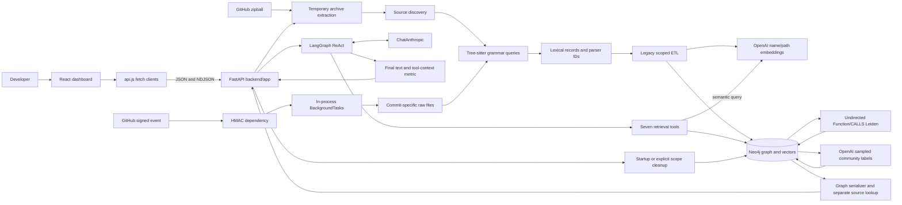
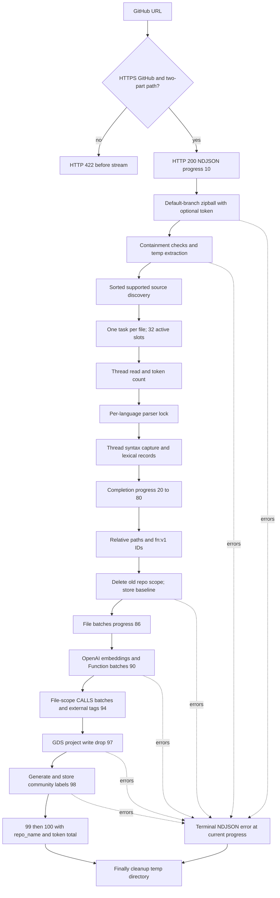
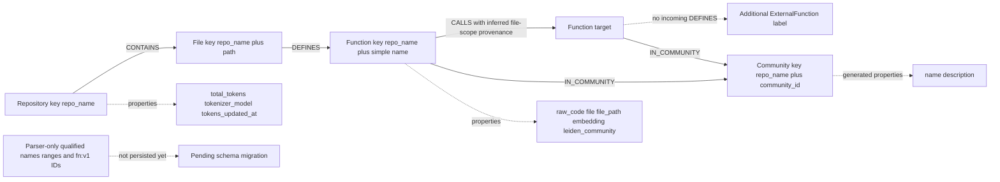
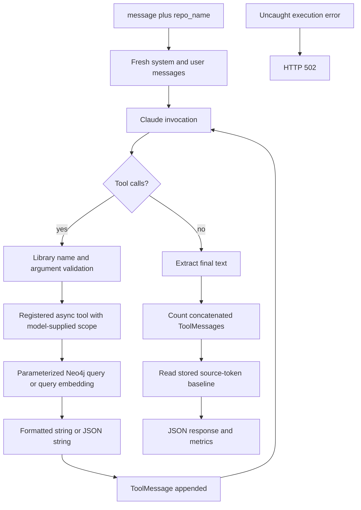
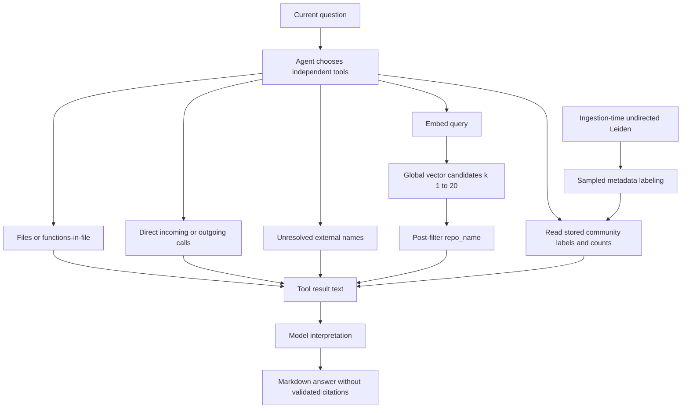
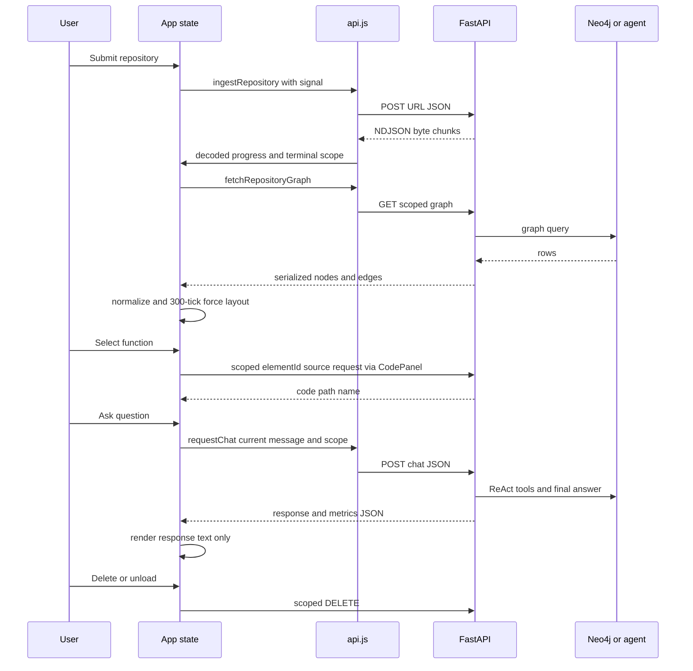

# Part 35 — Final review, cheat sheet and readiness

[Start here](README.md) · [Master index](CODEGRAPH_ENGINEERING_MASTERY.md) · [Previous](06_EVIDENCE.md) · [Next](CODEGRAPH_ENGINEERING_MASTERY.md)

## Contents

- [One-page CodeGraph mastery cheat sheet](#one-page-codegraph-mastery-cheat-sheet)
- [Complete architecture diagram](#complete-architecture-diagram)
- [Complete repository ingestion diagram](#complete-repository-ingestion-diagram)
- [Complete persistent graph model diagram](#complete-persistent-graph-model-diagram)
- [Complete AI-agent execution diagram](#complete-ai-agent-execution-diagram)
- [Complete implemented Graph-RAG retrieval diagram](#complete-implemented-graph-rag-retrieval-diagram)
- [Frontend-to-backend interaction diagram](#frontend-to-backend-interaction-diagram)
- [Every tool in one line](#every-tool-in-one-line)
- [Decisions and limitations to keep paired](#decisions-and-limitations-to-keep-paired)
- [The 30 questions you must answer](#the-30-questions-you-must-answer)
- [The 15 hardest questions](#the-15-hardest-questions)
- [Source-code reading checklist](#source-code-reading-checklist)
- [Technical readiness assessment](#technical-readiness-assessment)
- [Final coverage audit against the 35 requested parts](#final-coverage-audit-against-the-35-requested-parts)

---

## One-page CodeGraph mastery cheat sheet

**Pitch:** CodeGraph is a local repository-exploration prototype combining syntax parsing, a Neo4j graph, metadata vector search, generated community summaries, a React Flow interface and a seven-tool Claude agent. It helps orient and investigate; it does not guarantee complete or correct repository understanding.

**Revision:** main / `79fa7689754af893e871436a911a0c4d245c6a43`, inspected 2026-09-24. Active application: `backend/app` + `frontend`; root Python modules are legacy.

**Ingestion:** HTTPS GitHub owner/repo URL → default-branch zipball → safe temporary extraction → fixed suffix/exclude discovery → read/count/Tree-sitter → relative paths/parser IDs → delete old scope → files → metadata embeddings/functions → calls/external tags → undirected Leiden → generated labels → NDJSON 100 → cleanup. No branch selector or atomic full-pipeline transaction.

**Parser:** `.py/.js/.jsx/.ts/.tsx/.go/.java`. Syntax captures, source spans, qualified definitions, signatures/occurrences, fn:v1 hashes, lexical call ownership/unattributed calls; targets unresolved. No import resolution. Same-language parser lock; 32 active full-ingest file slots, not 32 simultaneous parser workers.

**Critical gap:** persistence ignores new IDs and lexical calls. Function key is repo_name+simple name; every file function gets every file-wide call target. Duplicate names and false edges affect retrieval, source lookup and communities.

**Graph:** Repository→CONTAINS→File→DEFINES→Function→CALLS→Function; extra ExternalFunction label for no stored definition; Function→IN_COMMUNITY→Community. Six ordinary indexes plus one vector index; no uniqueness constraints. 100-record transactions. Graph API caps 200 rows, not nodes. UI/source uses elementId.

**Models:** chat `claude-sonnet-5`; embeddings `text-embedding-3-small`, 1536 dimensions, cosine, name+path only; community labels `gpt-4o-mini`, 15 names/5 paths. Configured identifiers, not live-verified availability.

**Agent:** direct callers; file structure; file functions; outgoing targets; external names; semantic hits; architecture labels. No source tool, persistent chat memory, enforced citation contract or automatic community-member expansion. Semantic candidates are global top-k then scope-filtered.

**Metrics:** supported-source baseline versus concatenated tool text; proxy tokenizer, excludes prompt/output/history billing. 737k→18k arithmetic is 97.56%, but the benchmark is unverified. Zero evidence can yield 100% “efficiency.”

**Security/lifecycle:** HMAC exact raw bytes with compare_digest, no replay check. Public API lacks auth; repo predicates and CORS are not ACLs. Startup deletes all scoped nodes; unload attempts scope deletion. No durable jobs, archive quotas or complete webhook reconciliation.

**Validation:** 96 current backend cases: 92 passed, 4 DB integrations skipped; 13 Node tests passed; Vite build passed with bundle warning. No live model/DB/Postman pipeline run. First improvements: identity/provenance, snapshots, auth, budgets and source-grounded evaluation.

## Complete architecture diagram

## Complete repository ingestion diagram

File-level parsing failures are often skipped rather than sent to the terminal error path. Error records do not roll back earlier graph transactions.

## Complete persistent graph model diagram

Ordinary indexes accelerate keys but do not enforce uniqueness. No Class/Branch/Import/User/Commit/call-site entity is persisted by the active writer.

## Complete AI-agent execution diagram

The diagram represents observable orchestration, not a claim to expose the model's private reasoning. No persistent history/checkpointer or request-bound scope injection is configured.

## Complete implemented Graph-RAG retrieval diagram

There is no automatic query-to-community selection or member-source subgraph expansion. Calling the architecture tool is not the same as retrieving a source-grounded induced subgraph.

## Frontend-to-backend interaction diagram

## Every tool in one line

| Registered tool | Exact concise capability |
|---|---|
| query_graph_blast_radius | Up to 100 direct caller rows for a simple name; inferred graph evidence. |
| list_codebase_structure | All indexed File paths in the supplied scope. |
| list_functions_in_file | Stored function names reached from a scoped File. |
| query_outgoing_dependencies | Direct outgoing target names, legacy paths and external flags. |
| list_external_dependencies | Names tagged ExternalFunction because no definition is stored. |
| semantic_code_search | Metadata-vector candidates, k clamped 1–20, global selection then repo filter. |
| analyze_architectural_subsystems | Stored generated community labels/counts, all communities ordered by count. |

## Decisions and limitations to keep paired

| Decision | Benefit | Limitation to state in the same answer |
|---|---|---|
| Tree-sitter | Multi-language syntax without execution | No semantic target resolution; selected construct coverage. |
| Neo4j + vectors + GDS | Unified graph/enrichment storage | Operational compatibility and incorrect current identity key. |
| Bounded tasks/batches | Responsive scheduling and finite write units | Same-language serialization, retained memory, partial graph commits. |
| Metadata embeddings | Small semantic inputs | No body behavior, no result cache, post-filter recall loss. |
| Leiden labels | Exploratory overview | No module-truth or answer-quality guarantee; sampled metadata. |
| ReAct tools | Flexible question-specific retrieval | Wrong choices/claims, no source tool or enforced scope/budget. |
| NDJSON | Incremental POST progress | No durable/resumable job, 200 can contain failure. |
| Lazy source API | Smaller graph payload | Unauthenticated source access and transient storage IDs. |
| Ephemeral cleanup | Simple local-session intent | Startup/unload destroy shared data and reduce reuse. |

## The 30 questions you must answer

Use the bank's Q numbers to find complete answers and follow-ups.

1. What problem does CodeGraph solve and for whom? — [Q001](03_QUESTION_BANK.md#q001-what-practical-problem-does-codegraph-address).
2. How does it differ from a chatbot reading files? — [Q004](03_QUESTION_BANK.md#q004-what-distinguishes-this-application-from-a-chatbot-reading-files).
3. Which app package is active, and why does launch directory matter? — [Q009](03_QUESTION_BANK.md#q009-why-are-there-two-fastapi-applications-in-this-repository).
4. What happens from URL submission to progress 100? — [Q010](03_QUESTION_BANK.md#q010-where-does-ingestion-end-and-question-answering-begin) and [ingestion walkthrough](01_FOUNDATIONS.md#4-repository-ingestion-in-exact-order).
5. How are URL/default-branch/private-repository rules implemented? — [Q049](03_QUESTION_BANK.md#q049-how-is-a-repository-url-validated), [Q050](03_QUESTION_BANK.md#q050-how-does-codegraph-choose-a-branch), [Q051](03_QUESTION_BANK.md#q051-what-happens-with-a-private-repository).
6. What does archive path validation prevent and miss? — [Q052](03_QUESTION_BANK.md#q052-how-is-archive-path-traversal-prevented).
7. What files and languages enter the index? — [Q042](03_QUESTION_BANK.md#q042-which-languages-are-actually-supported)/[Q053](03_QUESTION_BANK.md#q053-which-files-are-discovered-and-counted).
8. How does a call differ from an identifier reference? — [Q043](03_QUESTION_BANK.md#q043-how-does-codegraph-distinguish-a-call-from-a-function-reference).
9. How do syntax and semantic resolution differ? — [Q041](03_QUESTION_BANK.md#q041-what-is-the-difference-between-a-concrete-and-abstract-syntax-tree-here)/[Q044](03_QUESTION_BANK.md#q044-can-tree-sitter-resolve-polymorphic-method-calls).
10. How are lexical ownership and anonymous boundaries handled? — [Q045](03_QUESTION_BANK.md#q045-how-are-nested-and-anonymous-calls-attributed).
11. How are parser IDs generated and when do they change? — [Q047](03_QUESTION_BANK.md#q047-how-are-function-ids-generated-and-what-remains-unstable).
12. Why do parser improvements not yet fix persistent identity? — [Q006](03_QUESTION_BANK.md#q006-what-is-the-most-important-current-limitation)/[Q066](03_QUESTION_BANK.md#q066-how-does-the-current-function-key-fail).
13. How are legacy CALLS edges constructed? — [Q003](03_QUESTION_BANK.md#q003-why-represent-code-as-a-graph-when-imports-already-exist)/[Q198](03_QUESTION_BANK.md#q198-a-function-returns-a-callback-that-calls-save-is-outer-shown-as-calling-save) and ETL:178.
14. What are the exact graph labels, edges and indexes? — [Q065](03_QUESTION_BANK.md#q065-what-labels-and-relationships-are-actually-stored)/[Q068](03_QUESTION_BANK.md#q068-what-uniqueness-constraints-exist).
15. Why are indexes different from uniqueness constraints? — [Q068](03_QUESTION_BANK.md#q068-what-uniqueness-constraints-exist).
16. What does 32-way bounded processing really mean? — [Q057](03_QUESTION_BANK.md#q057-is-codegraph-really-parsing-32-files-simultaneously), [Q058](03_QUESTION_BANK.md#q058-how-does-the-gil-affect-this-pipeline), [Q059](03_QUESTION_BANK.md#q059-does-the-semaphore-provide-full-backpressure), [Q060](03_QUESTION_BANK.md#q060-what-happens-if-the-concurrency-limit-increases-to-1000).
17. Where are transaction boundaries and partial-state risks? — [Q063](03_QUESTION_BANK.md#q063-why-batch-database-writes-by-100-records)/[Q194](03_QUESTION_BANK.md#q194-the-embedding-provider-fails-after-half-the-functions-are-written-what-remains).
18. What text is embedded by which model/dimension? — [Q097](03_QUESTION_BANK.md#q097-what-exactly-does-codegraph-embed), [Q098](03_QUESTION_BANK.md#q098-which-embedding-model-and-dimensions-are-used).
19. Why can vector scope post-filtering reduce recall? — [Q078](03_QUESTION_BANK.md#q078-why-can-vector-search-return-fewer-than-top_k-matches-for-the-selected-repository)/[Q196](03_QUESTION_BANK.md#q196-a-global-vector-top-five-contains-only-another-repository-will-five-local-matches-be-returned).
20. What graph does Leiden analyze and what does it write? — [Q081](03_QUESTION_BANK.md#q081-which-graph-algorithms-does-the-backend-actually-run), [Q082](03_QUESTION_BANK.md#q082-why-are-calls-projected-as-undirected-for-leiden), [Q083](03_QUESTION_BANK.md#q083-are-call-frequencies-used-as-edge-weights)/[Q089](03_QUESTION_BANK.md#q089-explain-leiden-without-claiming-it-understands-software)/[Q092](03_QUESTION_BANK.md#q092-what-leiden-configuration-does-codegraph-explicitly-set).
21. How are community labels produced, and are they validated? — [Q094](03_QUESTION_BANK.md#q094-how-are-community-names-generated).
22. What is the actual Graph-RAG sequence? — [Q105](03_QUESTION_BANK.md#q105-what-is-the-actual-rag-pipeline)/[Q096](03_QUESTION_BANK.md#q096-does-the-architecture-tool-retrieve-a-query-specific-leiden-subgraph).
23. What are the seven tools and their limits? — [Q121](03_QUESTION_BANK.md#q121-what-do-reasoning-action-and-observation-mean-in-this-agent), [Q122](03_QUESTION_BANK.md#q122-when-is-a-multi-tool-sequence-justified), [Q123](03_QUESTION_BANK.md#q123-how-does-dependency-analysis-differ-from-semantic-search), [Q124](03_QUESTION_BANK.md#q124-what-if-the-model-chooses-the-wrong-analysis-tool), [Q125](03_QUESTION_BANK.md#q125-can-the-model-access-a-different-repository-through-a-tool), [Q126](03_QUESTION_BANK.md#q126-why-are-tool-names-potentially-misleading-here), [Q127](03_QUESTION_BANK.md#q127-can-the-current-agent-verify-a-functions-source-implementation), [Q128](03_QUESTION_BANK.md#q128-what-makes-a-tool-result-trustworthy-enough-to-cite) and [all seven tool profiles](02_APPLICATION_AND_AUDIT.md#15-profiles-of-all-seven-registered-tools).
24. How does the ReAct loop use state and stop? — [Q113](03_QUESTION_BANK.md#q113-what-state-does-the-active-agent-carry), [Q114](03_QUESTION_BANK.md#q114-what-causes-the-agent-loop-to-continue-or-stop).
25. Does the backend remember chat history or read source? — [Q037](03_QUESTION_BANK.md#q037-can-the-conversation-remember-an-earlier-question)/[Q127](03_QUESTION_BANK.md#q127-can-the-current-agent-verify-a-functions-source-implementation).
26. What exactly do token metrics measure? — [Q107](03_QUESTION_BANK.md#q107-what-does-the-975-context-reduction-claim-establish), [Q108](03_QUESTION_BANK.md#q108-what-is-included-in-the-baseline-and-context-counts), [Q109](03_QUESTION_BANK.md#q109-could-an-answer-with-no-evidence-show-perfect-efficiency).
27. How does NDJSON handle partial chunks and runtime errors? — [Q025](03_QUESTION_BANK.md#q025-why-can-ingestion-return-http-200-when-it-failed)/[Q174](03_QUESTION_BANK.md#q174-why-ndjson-instead-of-websockets) and [NDJSON walkthrough](02_APPLICATION_AND_AUDIT.md#20-ndjson-streaming-and-progress).
28. What does HMAC protect, and what about replay/authorization? — [Q145](03_QUESTION_BANK.md#q145-does-repository-scoping-prevent-one-user-accessing-another-users-code), [Q146](03_QUESTION_BANK.md#q146-how-is-the-webhook-signature-computed-and-checked), [Q147](03_QUESTION_BANK.md#q147-are-webhook-replay-attacks-prevented).
29. What tests ran, and what do mocks/skips leave unverified? — [Q153](03_QUESTION_BANK.md#q153-how-many-tests-are-present-at-the-analyzed-revision), [Q154](03_QUESTION_BANK.md#q154-what-do-the-parser-tests-prove-and-not-prove), [Q155](03_QUESTION_BANK.md#q155-why-are-mocked-database-tests-useful), [Q156](03_QUESTION_BANK.md#q156-what-does-the-postman-repository-workflow-automate), [Q157](03_QUESTION_BANK.md#q157-how-does-postman-validate-webhook-hmac-behavior), [Q158](03_QUESTION_BANK.md#q158-do-the-node-tests-validate-react-rendering), [Q159](03_QUESTION_BANK.md#q159-what-does-the-token-metrics-unit-test-actually-assert), [Q160](03_QUESTION_BANK.md#q160-what-is-the-highest-value-missing-test-category).
30. What should change before enterprise deployment? — [Q163](03_QUESTION_BANK.md#q163-how-would-you-support-hundreds-of-concurrent-users)/[Q167](03_QUESTION_BANK.md#q167-what-is-required-for-enterprise-monorepositories)/[Q189](03_QUESTION_BANK.md#q189-what-should-change-before-exposing-the-api-publicly).

## The 15 hardest questions

1. Why should an interviewer trust your blast-radius output when file-wide targets are assigned to every function? — [Q003](03_QUESTION_BANK.md#q003-why-represent-code-as-a-graph-when-imports-already-exist)/[Q198](03_QUESTION_BANK.md#q198-a-function-returns-a-callback-that-calls-save-is-outer-shown-as-calling-save); [drill A](05_MOCK_INTERVIEWS.md#drill-a--from-parsing-to-runtime-truth).
2. How do you distinguish the payment `validate` from authentication `validate` after Neo4j has merged them? — [Q193](03_QUESTION_BANK.md#q193-two-files-define-validate-and-a-user-asks-who-calls-the-payment-one-what-happens).
3. Can a model request another repository despite the system prompt, and how do you enforce the contrary? — [Q125](03_QUESTION_BANK.md#q125-can-the-model-access-a-different-repository-through-a-tool); [drill C](05_MOCK_INTERVIEWS.md#drill-c--from-scoped-cypher-to-tenant-authorization).
4. How can an unsupported answer receive 100% efficiency? — [Q109](03_QUESTION_BANK.md#q109-could-an-answer-with-no-evidence-show-perfect-efficiency)/[Q199](03_QUESTION_BANK.md#q199-the-agent-reports-100-efficiency-and-a-confident-architecture-answer-is-that-success).
5. Where is the raw evidence for 737,000→18,000, and what exactly did the denominator include? — [Q107](03_QUESTION_BANK.md#q107-what-does-the-975-context-reduction-claim-establish)/[Q108](03_QUESTION_BANK.md#q108-what-is-included-in-the-baseline-and-context-counts); [drill B](05_MOCK_INTERVIEWS.md#drill-b--from-token-arithmetic-to-economic-evidence).
6. How do you separate ANN misses from global-candidate post-filtering losses? — [Q100](03_QUESTION_BANK.md#q100-why-use-approximate-rather-than-exhaustive-nearest-neighbor-search)/[Q196](03_QUESTION_BANK.md#q196-a-global-vector-top-five-contains-only-another-repository-will-five-local-matches-be-returned).
7. Why does a high Leiden modularity score not establish architectural truth? — [Q087](03_QUESTION_BANK.md#q087-what-does-modularity-tell-you-about-answer-quality).
8. Does Leiden improve answer quality at equal budgets, or merely produce attractive summaries? — [Q141](03_QUESTION_BANK.md#q141-how-would-you-prove-leiden-improves-retrieval).
9. What consistency guarantee holds when the embedding provider fails after deletion and partial writes? — [Q194](03_QUESTION_BANK.md#q194-the-embedding-provider-fails-after-half-the-functions-are-written-what-remains); [drill D](05_MOCK_INTERVIEWS.md#drill-d--from-batching-to-consistent-publication).
10. What happens when two workers run the same GDS projection name concurrently? — [Q056](03_QUESTION_BANK.md#q056-what-happens-when-two-ingestions-target-the-same-repository)/[Q095](03_QUESTION_BANK.md#q095-what-if-leiden-or-projection-cleanup-fails).
11. Why does API startup delete everyone’s repository graph, and how does that affect horizontal scaling? — [Q032](03_QUESTION_BANK.md#q032-what-happens-if-you-launch-several-api-workers)/[Q195](03_QUESTION_BANK.md#q195-a-second-worker-starts-while-someone-is-chatting-what-could-happen).
12. How would you preserve identity, references and community labels across moves, overload edits and branch updates? — [Q047](03_QUESTION_BANK.md#q047-how-are-function-ids-generated-and-what-remains-unstable)/[Q071](03_QUESTION_BANK.md#q071-are-neo4j-element-ids-durable-application-identifiers)/[Q093](03_QUESTION_BANK.md#q093-are-community-ids-stable-between-ingestions).
13. How do you reconcile a removed function and all dependent edges without reprocessing everything? — [Q164](03_QUESTION_BANK.md#q164-how-would-you-implement-incremental-indexing-properly)/[Q188](03_QUESTION_BANK.md#q188-how-would-you-repair-webhook-updates).
14. Why use an agent for queries a fixed Cypher endpoint can answer, and what would you simplify? — [Q121](03_QUESTION_BANK.md#q121-what-do-reasoning-action-and-observation-mean-in-this-agent)/[Q175](03_QUESTION_BANK.md#q175-why-an-agent-instead-of-a-fixed-retrieval-pipeline).
15. What did you personally design, debug and verify, and what evidence supports that account? — [Q177](03_QUESTION_BANK.md#q177-what-does-git-establish-about-project-ownership)/[Q184](03_QUESTION_BANK.md#q184-what-was-the-hardest-personal-engineering-challenge); [personal contribution preparation](05_MOCK_INTERVIEWS.md#34-personal-contributions-and-ai-assisted-development).

## Source-code reading checklist

- [ ] Explain active versus legacy package boundaries and configuration loading.
- [ ] Trace all eight active route method/path contracts and failure statuses.
- [ ] Read URL normalization, GitHub headers, archive extraction and cleanup.
- [ ] List discovery suffixes/excludes and missing resource controls.
- [ ] Explain every language's definition/call/class query and omissions.
- [ ] Trace qualification, signature/occurrence, ranges and ID encoding.
- [ ] Trace anonymous/nested call ownership and unresolved targets.
- [ ] Compare lexical records with `_extract_etl_records` output.
- [ ] Explain every MERGE/delete query and batch transaction boundary.
- [ ] List all six ordinary indexes and the vector index; explain absent constraints.
- [ ] Identify embedding input, response validation and cache boundaries.
- [ ] Explain GDS projection, Leiden write, finally drop and labeling transaction.
- [ ] Read all seven tool queries and output formats, including missing limits.
- [ ] Trace fresh agent state, framework defaults, errors and final text extraction.
- [ ] Calculate token metrics, including no-tool, zero-baseline and negative cases.
- [ ] Trace graph serialization/redaction, source lookup and element IDs.
- [ ] Explain React state, D3 layout, filters, source cancellation and stale fetch risks.
- [ ] Trace NDJSON bytes→lines→records→completion and separate JSON chat behavior.
- [ ] Verify HMAC ordering, incomplete webhook reconciliation and replay gaps.
- [ ] Explain what each test layer establishes and which integrations remain unrun.
- [ ] Read actual history diffs for batching/identity, not only commit subjects.
- [ ] Separate documentary suggestions, historical facts, implemented behavior and personal recollection.

## Technical readiness assessment

Score each dimension 0–3: 0 cannot explain; 1 can describe names; 2 can trace source and limits; 3 can handle a counterexample and defend a tested improvement. This is a self-assessment, not an evaluation of the developer's current knowledge.

| Dimension | Ready when… | Remaining evidence gap |
|---|---|---|
| End-to-end architecture | You can draw both ingestion and chat/source paths without conflating them | No live end-to-end provider/browser run performed in this audit. |
| Parsing and identity | You can work through overloads, anonymous calls and persistence loss | Broader syntax/semantic coverage requires more fixtures and resolver work. |
| Graph/Cypher | You can explain keys, queries, limits, projections and transaction states | Live plans, SEARCH compatibility and GDS binary defaults unverified. |
| AI/retrieval | You can name all tools and distinguish observations from interpretations | No source-grounded answer benchmark or Leiden ablation. |
| Performance | You can derive likely growth drivers without claiming unmeasured speedups | No workload latency/throughput/cost/resource dataset. |
| Security | You can separate scoping, auth, HMAC, replay, CORS and injection surfaces | No deployment penetration/vulnerability scan or tenant tests. |
| Frontend | You can trace normalization/layout/effects and reproduce race timelines | Browser/component behavior not exercised here. |
| Testing | You can explain 96 current cases, mocks and four skips accurately | Live DB/provider/Postman quality not established. |
| History/ownership | You can connect real decisions to diffs and actual personal validation | AI assistance, personal motivations and hardest debugging story require you. |
| Resume claims | You can qualify every numeric/capability statement | Original 737k/18k benchmark artifacts must be supplied to defend that result. |

A reasonable preparation goal is at least 2 in every dimension and 3 in the areas you claim as your strongest contributions. Rehearse the counterexamples, not only happy paths. If asked beyond available evidence, state the boundary and propose a specific experiment.

## Final coverage audit against the 35 requested parts

This table maps topic coverage, not proof that every requested depth criterion is complete. See the [current scope note](README.md#scope-of-this-update) for the outstanding content-expansion work.

| Part | Delivered evidence/content |
|---|---|
| 1 | Pinned revision, clean initial status, source/history census, versions, read-only constraints and verification labels; [volume 01](01_FOUNDATIONS.md) / [volume 06](06_EVIDENCE.md). |
| 2 | Five explanation levels, problem/users/value/limitations; [volume 01](01_FOUNDATIONS.md) section 2. |
| 3 | Component contracts and six diagram types; [volume 01](01_FOUNDATIONS.md) / [volume 07](07_FINAL_REVIEW.md). |
| 4 | Exact stages plus failure/branch/concurrency/reingestion matrix and incremental proposal; [ingestion walkthrough](01_FOUNDATIONS.md#4-repository-ingestion-in-exact-order). |
| 5 | All supported grammars/captures, syntax/semantic limits and worked language examples; [volume 01](01_FOUNDATIONS.md) section 5. |
| 6 | Semaphore/executor/locks/order/failures/memory/GIL and alternatives; [volume 01](01_FOUNDATIONS.md) section 6. |
| 7 | All persistent entities/relationships/properties, indexes/no constraints and alternatives; [volume 01](01_FOUNDATIONS.md) section 7. |
| 8 | Query atlas, exact query text, Cypher basics, direct/proposed bounded traversal and complexity; [volume 01](01_FOUNDATIONS.md) / [volume 06](06_EVIDENCE.md). |
| 9 | ETL passes, dedup/key mismatch, transaction/recovery/visibility analysis; [volume 01](01_FOUNDATIONS.md) section 9. |
| 10 | Exact embedding input/model/dimension/batching/storage/ranking/limitations and vector concepts; [volume 01](01_FOUNDATIONS.md) section 10. |
| 11 | Actual agentic retrieval sequence, missing grounding/context controls and alternatives; [volume 01](01_FOUNDATIONS.md) section 11. |
| 12 | Projection, Leiden objective/default caveats, labels, actual retrieval and alternatives; [volume 01](01_FOUNDATIONS.md) section 12. |
| 13 | Arithmetic, benchmark evidence search, baseline/context methodology and limits; [volume 01](01_FOUNDATIONS.md) section 13. |
| 14 | Active prebuilt agent, state, loop, stopping, memory, local library defaults and errors; [volume 02](02_APPLICATION_AND_AUDIT.md) section 14. |
| 15 | Seven detailed tool profiles with inputs/outputs/examples/query/security/performance/use limits; [all seven tool profiles](02_APPLICATION_AND_AUDIT.md#15-profiles-of-all-seven-registered-tools). |
| 16 | Active prompts, role/data trust, history, scope and injection analysis; [volume 02](02_APPLICATION_AND_AUDIT.md) section 16. |
| 17 | Agent/framework/provider rationale, simpler alternatives and historical qualification; [volume 02](02_APPLICATION_AND_AUDIT.md) section 17. |
| 18 | Every active endpoint, schemas/status/lifecycle/dependencies/cancellation concerns; [volume 02](02_APPLICATION_AND_AUDIT.md) section 18. |
| 19 | Components/state/hooks/layout/requests/errors/races/large-graph limits; [volume 02](02_APPLICATION_AND_AUDIT.md) section 19. |
| 20 | NDJSON generation/byte framing/terminal semantics/cancellation and transport comparison; [NDJSON walkthrough](02_APPLICATION_AND_AUDIT.md#20-ndjson-streaming-and-progress). |
| 21 | Threat model, controls/limits, HMAC/replay/path/resource/auth boundaries; [volume 02](02_APPLICATION_AND_AUDIT.md) section 21. |
| 22 | Exact 96-case test inventory, 13 Node results, 23 Postman requests and chained assertions; [volume 02](02_APPLICATION_AND_AUDIT.md) / [volume 06](06_EVIDENCE.md). |
| 23 | Missing quality evidence and rigorous fixed-SHA controlled evaluation design; [volume 02](02_APPLICATION_AND_AUDIT.md) section 23. |
| 24 | Stage-by-stage growth/bottlenecks/cache/distribution/enterprise proposals; [volume 02](02_APPLICATION_AND_AUDIT.md) section 24. |
| 25 | All available milestone groups, relevant diffs, documented validation and motivation limits; [volume 02](02_APPLICATION_AND_AUDIT.md) / [volume 06](06_EVIDENCE.md). |
| 26 | Comprehensive technology/architecture trade-off matrix; [volume 02](02_APPLICATION_AND_AUDIT.md) section 26. |
| 27 | Evidence/status/trigger/impact/investigation/remedy/trade-offs register; [volume 02](02_APPLICATION_AND_AUDIT.md) section 27. |
| 28 | 200 questions across A–Y, each with all eight requested response elements; [volume 03](03_QUESTION_BANK.md). |
| 29 | Decision-defense scripts separating rationale from personal history; [volume 04](04_STUDY_AND_DEFENSE.md) section 29. |
| 30 | Nineteen claim-defense cards with implementation, concise/deep explanation and challenges; [volume 04](04_STUDY_AND_DEFENSE.md) section 30. |
| 31 | 25 source-reading targets and all 14 requested traces, including explicitly absent subgraph behavior; [volume 04](04_STUDY_AND_DEFENSE.md) section 31. |
| 32 | 50 facts, glossary, exercises and separate answer key, whiteboard tasks; [volume 04](04_STUDY_AND_DEFENSE.md) section 32. |
| 33 | Six interviews, ten substantial questions each, follow-ups, model answers and evaluation criteria; [volume 05](05_MOCK_INTERVIEWS.md). |
| 34 | Ownership/AI-assistance evidence limits and seven personal-answer templates; [volume 05](05_MOCK_INTERVIEWS.md) section 34. |
| 35 | Master Markdown index, self-contained volumes, cheat sheet, diagrams, tools/decisions/limits, 30 essential/15 hard questions, checklist, readiness and this audit. |

**Deliberately unresolved rather than invented:** live service compatibility, actual model availability, real-world scalability, retrieval/answer quality, the supplied quantitative benchmark, and firsthand personal contribution stories. The read-only investigation establishes where those gaps arise and how to close them without representing proposals as implemented capabilities.

---

[Back to contents](#contents) · [Start here](README.md) · [Master index](CODEGRAPH_ENGINEERING_MASTERY.md) · [Previous](06_EVIDENCE.md) · [Next](CODEGRAPH_ENGINEERING_MASTERY.md)
