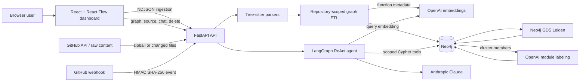
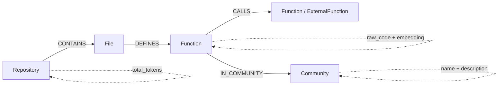
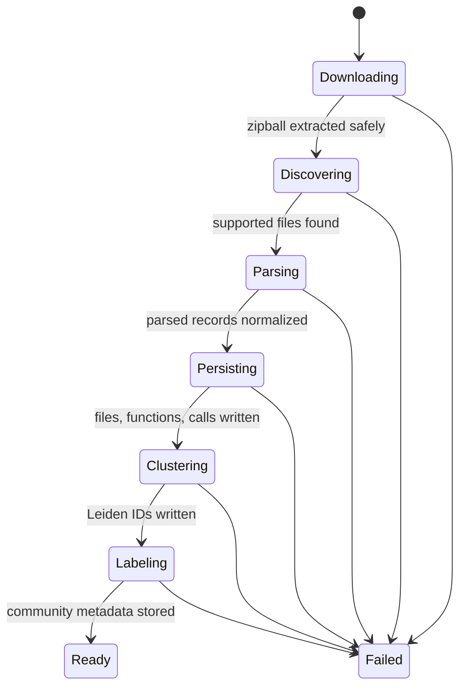

# Codegraph

A repository intelligence workspace that turns a GitHub codebase into a queryable Neo4j function graph, detects architectural communities, and answers scoped code questions through a graph-aware AI agent.

Codegraph is built for the point where a repository is too large to understand by opening files one at a time. Give the dashboard a public or token-accessible GitHub repository, and the backend downloads its default branch, parses supported source files with Tree-sitter, writes a repository-scoped knowledge graph, enriches functions with embeddings, and groups the call graph into architectural communities with Neo4j Graph Data Science.

The resulting graph is both visual and conversational. The React dashboard exposes file/function relationships, source code, dependency neighborhoods, and LLM-labeled modules; a LangGraph ReAct agent answers questions using targeted Neo4j tools instead of placing the entire repository into every model request.

> [!IMPORTANT]
> Codegraph is an engineering prototype intended for local exploration. It has no application-level authentication, clears repository-scoped graphs when the API starts, and performs best-effort static analysis rather than compiler-accurate symbol resolution. See [Current limitations](#current-limitations) before using it with private or production code.

## Highlights

- **Multi-language parsing:** Tree-sitter extraction for seven source extensions across Python, JavaScript/JSX, TypeScript/TSX, Go, and Java.
- **Repository-scoped graph model:** every repository, file, function, community, and query is keyed by canonical `owner/repository` context.
- **Streaming ingestion:** the API returns newline-delimited JSON progress while downloading, parsing, embedding, persisting, clustering, and labeling a repository.
- **Graph-RAG agent:** a Claude-powered LangGraph agent can inspect structure, functions, direct callers, outgoing calls, external dependencies, semantic matches, and architectural subsystems.
- **Semantic retrieval:** OpenAI `text-embedding-3-small` vectors are stored in a 1,536-dimensional Neo4j vector index.
- **Architectural discovery:** Neo4j GDS projects each repository's function-call graph as undirected, runs Leiden clustering, and releases the in-memory projection even when the algorithm fails.
- **Interactive graph UI:** React Flow visualization with force-directed layout, dependency highlighting, module filtering, minimap navigation, and on-demand syntax-highlighted source.
- **Incremental GitHub path:** HMAC-verified `push` and `pull_request` webhooks can process changed files in a FastAPI background task.
- **Focused correctness tests:** the test suite covers repository isolation, bounded database batches, source redaction from graph payloads, index creation, GDS cleanup, parser failure handling, API contracts, and frontend scoping.

## Architecture



### Components

| Component | Responsibility |
| --- | --- |
| **React dashboard** | Starts ingestion, renders the repository graph, filters architectural communities, opens function source, and submits repository-scoped questions. |
| **FastAPI backend** | Validates repository identifiers and URLs, streams ingestion progress, exposes graph/chat/source/deletion endpoints, and accepts signed GitHub webhooks. |
| **Tree-sitter parser layer** | Extracts class names, function definitions with exact source spans, and call expression names from supported files without executing repository code. |
| **Neo4j persistence layer** | Stores repository, file, function, call, external-function, community, embedding, source, and token-baseline data. Neo4j is the authoritative application data store. |
| **Neo4j Graph Data Science** | Builds a temporary repository-specific projection, treats call relationships as undirected for community detection, and writes Leiden community IDs back to function nodes. |
| **OpenAI enrichment** | Generates function embeddings from function name plus file path, and structured names/descriptions for detected communities. |
| **LangGraph agent** | Lets Claude choose narrowly scoped graph tools and reports the size of tool context relative to the stored full-repository token baseline. |
| **GitHub integration** | Downloads the current default branch for full ingestion and retrieves immutable raw-file revisions for supported webhook events. |

### Data model



The repository key is the normalized GitHub `owner/repository` name. Full ingestion replaces nodes in only that scope; graph reads, source lookup, deletion, agent tools, community queries, and token-baseline reads all include the same scope.

Function nodes are currently merged by `(repo_name, name)`, not by file-qualified identity. That is simple and effective for many repositories, but same-named functions in different files can collapse into one node. This is documented as a limitation rather than treated as symbol-level correctness.

## How repository ingestion works



This diagram represents the streamed request lifecycle; the backend does not persist a separate ingestion-state record.

1. **Validate the repository.** `POST /api/ingest-repo` accepts only an HTTPS `github.com` repository URL. The UI also accepts `owner/repository` shorthand and converts it to that URL form.
2. **Download the default branch.** The backend requests GitHub's repository zipball without a ref, follows redirects, checks every archive member against path traversal, and extracts into a managed temporary directory.
3. **Discover source.** `.py`, `.js`, `.jsx`, `.ts`, `.tsx`, `.go`, and `.java` files are included. `.git`, virtual environments, caches, `build`, `dist`, and `node_modules` directories are skipped.
4. **Parse concurrently.** File work is scheduled asynchronously with at most 32 file-read slots. CPU-bound Tree-sitter parsing runs in worker threads; a per-language lock prevents concurrent use of a shared parser instance. Failed files advance progress but are not persisted.
5. **Create a token baseline.** Every readable discovered source file is counted with tiktoken's `gpt-4o` encoding, including files whose parse later fails. The total is stored on the repository node for context-efficiency reporting.
6. **Normalize and flatten.** Temporary paths become stable repository-relative paths. Parsed files are flattened into file, function, and call records.
7. **Replace the repository scope.** Existing nodes for the selected repository are deleted, then records are written in bounded batches of 100 through separate Neo4j write transactions.
8. **Embed functions.** Each function is embedded from its name and file path with `text-embedding-3-small`; the code body is not part of the current embedding input.
9. **Map calls and external targets.** Unresolved targets become `ExternalFunction`-labeled nodes after the call pass.
10. **Detect and describe modules.** GDS writes Leiden IDs, then `gpt-4o-mini` produces a structured module name and one-sentence description from up to 15 function names and five file paths per community.
11. **Return the active scope.** The final NDJSON record contains `repo_name` and `total_repo_tokens`; the dashboard loads that repository's graph.

### Replacement and failure semantics

Full ingestion is **repository-scoped but not atomic as a whole**. Deletion, each file/function/call micro-batch, token storage, clustering, and community replacement use their own transactions. This bounds individual transaction size, but an embedding, database, GDS, or model failure after deletion can leave a partially rebuilt scope.

The streaming endpoint reports operational failures in its NDJSON body because response headers may already have been sent. Clients must inspect progress records for an `error` field; an HTTP `200` alone does not prove that ingestion completed.

## Static-analysis model

Codegraph deliberately uses syntax-level extraction rather than importing, compiling, or executing the target repository. The parser records:

- function, method, and constructor names supported by each grammar query;
- the exact source span for each captured definition;
- class/type names for the parse result; and
- direct identifier/member-call names such as `send()` or `client.send()`.

The persistence layer currently associates the set of calls found in a file with every function captured from that file. It does not resolve lexical ownership, imports, overloads, dynamic dispatch, aliases, or cross-file symbols. Classes are extracted but not yet represented as Neo4j nodes. Consequently, the graph is useful for exploration and retrieval, but it is not a compiler-grade call graph or a safe basis for automated refactoring.

## Graph-RAG agent

The chat endpoint invokes a repository-scoped LangGraph ReAct agent backed by `claude-sonnet-5`. The model can choose among seven tools:

| Tool capability | What it reads |
| --- | --- |
| Blast radius | Direct callers of a named function |
| Codebase structure | Sorted repository file paths |
| Functions in file | Functions defined by one stored file |
| Outgoing dependencies | Direct call targets for a named function |
| External dependencies | Targets without a stored definition |
| Semantic code search | Top vector matches for a natural-language query |
| Architectural subsystems | Stored community names, descriptions, and function counts |

Every Cypher query includes a repository predicate. The agent system prompt also instructs Claude to use the exact active repository name and to use stored community summaries for architecture questions.

After a response, Codegraph counts only the graph-tool outputs supplied to the model and compares that count with the stored full-source baseline:

```json
{
  "response": "...",
  "metrics": {
    "full_repo_tokens": 150000,
    "context_tokens": 4200,
    "tokens_saved": 145800,
    "efficiency_percentage": 97.2
  }
}
```

These are **context-selection metrics**, not latency, cost, answer-quality, or end-to-end token benchmarks. `context_tokens` excludes the system prompt, user question, model output, and non-tool message content. The values therefore show how much graph-tool text was selected relative to the raw repository baseline, not total API usage.

## Dashboard

The Vite/React interface provides two coordinated workspaces:

- a repository input, streamed ingestion progress, Markdown chat, cancellation, and explicit repository deletion;
- a force-directed React Flow map with file hubs, function/external nodes, directed calls, minimap, fit/zoom controls, and a maximized graph mode;
- hover focus that dims unrelated nodes and animates adjacent edges;
- deterministic community colors, a module legend with LLM-generated descriptions, and multi-community filtering; and
- an on-demand source drawer with line numbers and syntax highlighting for every supported language.

The graph API deliberately removes `raw_code` from its bulk node payload. Source is fetched only when a user selects a function, using both the Neo4j element ID and active repository scope.

## Quick start

### Prerequisites

- Python 3.10 or newer (the backend was verified with Python 3.13)
- Node.js `^20.19.0` or `>=22.12.0` (required by the locked Vite toolchain)
- pnpm
- Docker with Docker Compose
- an OpenAI API key for ingestion embeddings and community labels
- an Anthropic API key for chat
- optionally, a GitHub token for private repositories and higher GitHub API limits

### 1. Clone the repository

```bash
git clone https://github.com/singhsitanshu/Codegraph.git
cd Codegraph
```

### 2. Start Neo4j with GDS

```bash
docker compose up -d neo4j
```

The Compose service exposes Neo4j Browser on port `7474`, Bolt on `7687`, stores data in the `neo4j_data` volume, and requests the Graph Data Science plugin. The checked-in development credentials are `neo4j` / `gladline`; change them before using the service outside an isolated local machine.

### 3. Configure and install the backend

The active backend reads `backend/.env`, not the root `.env` used by older prototype files.

```bash
python3 -m venv .venv
source .venv/bin/activate
pip install -r backend/requirements.txt
cp backend/.env.example backend/.env
```

Edit `backend/.env` so the Neo4j password matches Compose and add the two model-provider keys:

```dotenv
GITHUB_WEBHOOK_SECRET=replace-with-a-long-random-secret
# GITHUB_TOKEN=github-token-with-read-access

NEO4J_URI=bolt://localhost:7687
NEO4J_USER=neo4j
NEO4J_PASSWORD=gladline

ANTHROPIC_API_KEY=replace-with-your-anthropic-key
OPENAI_API_KEY=replace-with-your-openai-key
```

Start FastAPI **from the backend directory** so Python resolves the current `app` package:

```bash
cd backend
uvicorn app.main:app --reload
```

Startup verifies Neo4j connectivity, creates the repository/property/vector indexes, waits for them to become available, clears repository-scoped data left by earlier app sessions, and then serves on `http://localhost:8000`.

### 4. Install and start the dashboard

In another terminal:

```bash
cd frontend
pnpm install --frozen-lockfile
pnpm dev
```

Open `http://localhost:5173`, enter a repository such as `psf/requests`, and select **Ingest**.

### 5. Verify the processes

```bash
curl http://localhost:8000/health
```

```json
{"status":"ok"}
```

`/health` is a process-liveness check only; it does not query Neo4j, GitHub, OpenAI, or Anthropic. FastAPI's generated API documentation is available at `http://localhost:8000/docs`.

## Local services

| Service | Address | Purpose |
| --- | --- | --- |
| Dashboard | `http://localhost:5173` | Repository ingestion, chat, graph exploration, and source viewer |
| FastAPI | `http://localhost:8000` | API, ingestion stream, agent, and webhook receiver |
| OpenAPI UI | `http://localhost:8000/docs` | Interactive endpoint documentation generated by FastAPI |
| Neo4j Browser | `http://localhost:7474` | Local graph/database inspection |
| Neo4j Bolt | `bolt://localhost:7687` | Backend database connection |

Only Neo4j is containerized. The API and dashboard run as local development processes; the repository does not currently include Dockerfiles or a production deployment manifest for them.

## Usage

### Ingest a repository without the UI

Use `-N` so curl displays progress as records arrive:

```bash
curl -N -X POST http://localhost:8000/api/ingest-repo \
  -H 'Content-Type: application/json' \
  -d '{"url":"https://github.com/psf/requests"}'
```

The final successful record resembles:

```json
{"status":"Repository ingestion complete.","progress":100,"repo_name":"psf/requests","total_repo_tokens":123456}
```

### Read the graph

```bash
curl 'http://localhost:8000/api/graph?repo_name=psf%2Frequests'
```

The response uses React Flow-compatible `nodes` and `edges`. The query currently returns at most 200 Neo4j records, so it is a visualization window rather than an unbounded graph export.

### Ask a graph-backed question

```bash
curl -X POST http://localhost:8000/api/chat \
  -H 'Content-Type: application/json' \
  -d '{"message":"Which functions call send, and where are they defined?","repo_name":"psf/requests"}'
```

The current backend returns one JSON response after the agent completes; only repository ingestion is streamed.

### Delete one repository scope

```bash
curl -X DELETE 'http://localhost:8000/api/repositories/psf%2Frequests'
```

The dashboard exposes the same operation behind a confirmation dialog and also sends a best-effort cleanup request when the page unloads.

## API overview

| Method | Endpoint | Purpose |
| --- | --- | --- |
| `GET` | `/health` | Process-liveness response; does not check dependencies |
| `POST` | `/api/ingest-repo` | Download and replace a GitHub repository graph; streams `application/x-ndjson` |
| `GET` | `/api/graph?repo_name=owner/repository` | Return a scoped, React Flow-compatible graph window |
| `GET` | `/api/node/{node_id}/code?repo_name=owner/repository` | Fetch one scoped function's stored source |
| `POST` | `/api/chat` | Answer a scoped graph question and return context-selection metrics |
| `DELETE` | `/api/repositories/{repo_name}` | Delete all graph data in one normalized repository scope |
| `DELETE` | `/api/repo` | JSON-body cleanup endpoint used by browser unload keepalive requests |
| `POST` | `/api/webhooks/github` | Verify and acknowledge a GitHub event for background processing |

Request models enforce nonblank inputs, a 10,000-character chat limit, canonical `owner/repository` identifiers, and HTTPS GitHub repository URLs.

## GitHub webhook path

Configure GitHub to send JSON events to:

```text
https://your-host.example/api/webhooks/github
```

The endpoint requires GitHub's `X-Hub-Signature-256` HMAC header and compares it in constant time against `GITHUB_WEBHOOK_SECRET`. Valid JSON object payloads are acknowledged with HTTP `202`, then processed through a FastAPI background task.

Current event behavior:

- `push` uses added and modified paths, fetches each file at the immutable `after` SHA, skips unsupported/deleted/unavailable files, parses successful responses, and merges them into the existing repository scope;
- `pull_request` can process filenames only when they are embedded in the payload by a provider or fixture; GitHub's standard pull-request payload does not include the file list, and the current backend does not yet call the pull-request files API;
- background exceptions are logged rather than returned to GitHub because acknowledgment has already occurred; and
- the placeholder "blast radius" stage logs changed filenames but does not yet run a separate impact-analysis agent.

Webhook updates are incremental merges. They do not remove deleted paths, recalculate the full-repository token baseline, or provide delivery idempotency. A later full ingestion is the authoritative way to reconcile upstream deletions.

## Correctness and reliability boundaries

| Mechanism | Implemented behavior | Boundary |
| --- | --- | --- |
| Repository isolation | Scope predicates are present in graph writes, reads, tools, source lookup, and deletion; tests exercise cross-repository separation. | There is no user/tenant authentication authorizing access to a scope. |
| Archive handling | Every zip member is resolved beneath the temporary extraction root before extraction. | Archive size and repository size are not limited by application configuration. |
| Database initialization | Required property and 1,536-dimension cosine vector indexes are created with `IF NOT EXISTS` and awaited once per process. | The API fails startup if Neo4j remains unreachable. |
| Bounded writes | Files, functions, and calls are committed in batches of 100. | A full replacement spans multiple transactions and can be partially applied. |
| Parser failures | Individual failed files are omitted while progress and token counting continue. | A completed ingestion can therefore represent fewer files than GitHub contained. |
| GDS cleanup | Temporary projections are dropped in a `finally` block, including algorithm/projection-consumption failures. | GDS or labeling failure fails the overall ingestion after graph records may already exist. |
| Source minimization | Bulk graph serialization strips `raw_code`; source requires a separate scoped lookup. | The unauthenticated source endpoint still exposes stored code to any caller that can reach it. |
| Webhook authenticity | HMAC SHA-256 signatures use `hmac.compare_digest`. | There is no replay cache, delivery-ID deduplication, queue, retry store, or webhook audit table. |

## Testing

### Backend

```bash
cd backend
pytest -q
```

The backend suite combines mocked unit/API tests with live-Neo4j integration cases. If Neo4j is unavailable, database integration tests skip themselves; start the Compose service and use matching credentials to exercise them.

Key validated behaviors include:

- parser coverage across all supported extensions and exact function-source capture;
- file-level failure isolation, concurrent progress reporting, and token-baseline accounting;
- repository-scoped graph writes, reads, source lookup, agent tools, and deletion;
- one transaction per persistence micro-batch for large inputs;
- embedding batching/order validation and community structured output;
- GDS projection, Leiden write, empty-graph handling, and guaranteed projection cleanup;
- graph serialization without source bodies; and
- database index initialization and application lifecycle cleanup.

In the latest local validation for this README, the backend completed **73 tests**, with **4 live-database tests skipped** because Neo4j was not running.

### Frontend

```bash
cd frontend
pnpm test
pnpm build
```

The Node test suite covers repository input normalization, chunked NDJSON parsing, error propagation, graph/chat scoping, source lookup, explicit and unload cleanup, deterministic community colors, and cluster selection. The production Vite build is also part of the recommended validation pass.

The latest local validation completed **13 frontend tests** and a production build. Vite reported that the generated JavaScript chunk exceeds its default 500 kB warning threshold; code splitting is not yet configured.

The root-level `tests/` directory exercises the older webhook prototype. Run active-backend tests from `backend/` to avoid importing the legacy root `app` package by mistake.

## Configuration

The active settings class loads `backend/.env`, is case-insensitive, ignores unknown keys, and provides development defaults.

| Variable | Required for | Default | Notes |
| --- | --- | --- | --- |
| `GITHUB_WEBHOOK_SECRET` | Secure webhook verification | `development_secret` | Replace before accepting webhook traffic. |
| `GITHUB_TOKEN` | Private repositories / higher GitHub limits | unset | Sent as a bearer token to GitHub API and raw-content requests. |
| `NEO4J_URI` | All graph operations | `bolt://localhost:7687` | Matches local Compose networking from the host. |
| `NEO4J_USER` | All graph operations | `neo4j` | Compose uses the same username. |
| `NEO4J_PASSWORD` | All graph operations | `password` | Set to `gladline` for the checked-in Compose configuration. |
| `ANTHROPIC_API_KEY` | Chat | empty | The active model is currently hard-coded to `claude-sonnet-5`. |
| `OPENAI_API_KEY` | Ingestion and semantic search | empty | Used by `text-embedding-3-small` and `gpt-4o-mini`. |

The older root `.env.example` includes `ANTHROPIC_MODEL` and `NEO4J_DATABASE`, but the active `backend/app` does not read those options. The frontend also hard-codes `http://localhost:8000` as its API base; Vite proxies relative `/api` requests to the same backend during development.

## Repository structure

```text
Codegraph/
├── backend/
│   ├── app/
│   │   ├── agent/          # LangGraph tools and agent orchestration
│   │   ├── api/            # GitHub webhook route and signature dependency
│   │   ├── db/             # Neo4j serialization, ETL, indexes, and GDS
│   │   ├── services/       # GitHub, parsing, embedding, labeling, and pipeline code
│   │   ├── utils/          # Token counting
│   │   ├── config.py       # Active backend settings
│   │   └── main.py         # FastAPI routes and ingestion lifecycle
│   ├── tests/              # Active backend unit/API/integration tests
│   └── requirements.txt
├── frontend/
│   ├── src/
│   │   ├── components/     # Source drawer and community legend
│   │   ├── utils/          # Community colors and filters
│   │   ├── App.jsx         # Dashboard and graph interaction
│   │   └── api.js          # Backend client and NDJSON reader
│   ├── package.json
│   └── pnpm-lock.yaml
├── app/                    # Earlier webhook/API prototype
├── tests/                  # Tests for the earlier webhook prototype
├── agent.py                # Earlier single-tool LangGraph prototype
├── database.py             # Earlier Neo4j wrapper
├── parse_python.py         # Earlier single-file Python parser CLI
└── docker-compose.yml      # Local Neo4j + GDS service
```

The `backend/` and `frontend/` directories form the current full application. Root-level Python modules remain useful as development history and focused prototypes, but their endpoints, environment file, and behavior differ from the active backend.

## Security and data handling

- The ingestion URL validator restricts downloads to HTTPS GitHub repository URLs, and archive extraction rejects paths outside its temporary directory.
- GitHub webhook payloads are authenticated with a shared HMAC secret. Other API routes have **no authentication or authorization**.
- Private-repository source can be downloaded with `GITHUB_TOKEN`, stored as `raw_code` in Neo4j, and returned through the source endpoint. Do not expose this API publicly without an access-control layer.
- OpenAI receives function names/file paths for embeddings and community labeling. Anthropic receives the user's question plus graph-tool outputs selected during the agent run. Review provider policies before ingesting sensitive repositories.
- Neo4j Browser and Bolt are bound to host ports with checked-in development credentials. Treat the Compose file as local-only.
- CORS permits the configured localhost dashboard origins; CORS is a browser policy, not an authorization boundary.
- Secrets belong in ignored `backend/.env`. Neither `.env` nor `backend/.env` should be committed.

## Current limitations

- **Ephemeral application lifecycle:** API startup deletes all nodes with a non-null `repo_name`, and the dashboard sends best-effort deletion on page unload. The Docker volume persists Neo4j storage, but current application behavior does not preserve ingested repositories across sessions.
- **Approximate call attribution:** call names are collected at file scope and attached to each function in that file; symbol ownership and dispatch are not resolved.
- **Name collisions:** functions are identified by repository plus unqualified name, so repeated names across files may merge.
- **Partial rebuilds are possible:** full ingestion replaces a scope across multiple transactions without rollback of the complete pipeline.
- **Graph reads are capped:** `/api/graph` applies `LIMIT 200` before frontend force layout.
- **No durable job system:** ingestion runs inside the request stream and webhooks use in-process background tasks. There is no queue, retry scheduler, checkpoint, cancellation persistence, or multi-process coordination.
- **Incomplete webhook reconciliation:** standard pull-request file discovery, removed-file deletion, delivery deduplication, and full token/community reconciliation are not implemented.
- **External-service dependency:** normal ingestion requires GitHub, OpenAI, Neo4j GDS, and compatible model/index APIs; chat additionally requires Anthropic.
- **Local deployment focus:** only Neo4j is containerized; there is no CI workflow, application Dockerfile, TLS termination, deployment manifest, metrics endpoint, tracing, or structured event store.
- **No application auth or multi-tenancy:** repository scoping prevents accidental query mixing but does not establish an authorization boundary.
- **Unpinned infrastructure image:** Compose uses `neo4j:latest`, so future image/plugin compatibility is not guaranteed.
- **Frontend bundle size:** the current production JavaScript chunk is above Vite's default warning threshold.

## Design tradeoffs

### Why Neo4j for both storage and retrieval?

Call relationships, dependency neighborhoods, and architecture clusters are naturally graph-shaped. Keeping raw graph state, vector embeddings, and GDS results in Neo4j avoids a separate queue/vector/database stack and lets agent tools express traversal directly in Cypher. The tradeoff is operational coupling to Neo4j editions/plugins and transaction patterns, plus a less portable local setup than an embedded store.

### Why Tree-sitter?

Tree-sitter supports the project's language set through precompiled grammar wheels and can inspect untrusted repositories without running their code. It also preserves exact source spans for captured definitions. The tradeoff is syntax-level knowledge: without compiler/type-system integration, Codegraph cannot promise resolved symbols or precise dynamic call relationships.

### Why graph tools instead of full-repository prompting?

Targeted tools make repository scope explicit and allow the model to request only structure or dependency evidence relevant to a question. The stored metric makes that selection visible. The tradeoff is that answer quality depends on parser fidelity, graph completeness, tool selection, and the model's ability to ask the right graph questions.

### Why bounded Neo4j batches?

Micro-batches keep individual writes finite for larger repositories and are directly tested. They also make streaming progress practical. The tradeoff is the loss of all-or-nothing replacement across the entire ingestion pipeline.

## Project status

The current application supports the complete local workflow: ingest a GitHub repository, construct and enrich its graph, inspect it visually, open stored function source, ask graph-backed questions, process a limited set of webhook updates, and delete repository-scoped data.

The repository does not contain benchmark artifacts, so Codegraph makes no throughput, latency, cost, or scale claims. The clearest next steps suggested by the implementation are qualified function identities and lexical call ownership, durable ingestion jobs with atomic version activation, complete GitHub event reconciliation, configurable model/API settings, persistent graph lifecycle controls, authentication, and deployment/observability tooling.

## License

No license file is currently included. Unless a license is added, the repository should not be assumed to grant open-source reuse rights.
